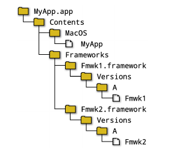

# Крэйг Скотт. CMake - Практическое руководство (14-е издание, вольный перевод).

## Глава 27. Команда install.

После всей тяжелой работы по разработке исходного кода проекта, созданию его различных ресурсов, обеспечению надежности сборки и внедрению автоматизированных тестов, решающим является последний шаг - предоставление программного обеспечения для распространения. Он напрямую влияет на первое впечатление конечного пользователя о проекте и, если он выполнен некачественно, может привести к тому, что программное обеспечение будет отвергнуто еще до того, как им начнут пользоваться. Разработчики и пользователи могут иметь разные мнения относительно того, как проект должен распространяться. Для некоторых достаточно просто предоставить доступ к репозиторию исходного кода и ожидать, что конечные пользователи сами соберут его. Хотя это может быть частью модели поставки, не все конечные пользователи захотят участвовать в проекте на таком низком уровне. Вместо этого они часто ожидают получить готовый бинарный пакет, который можно установить и использовать на своей машине, предпочтительно через какую-то уже знакомую систему управления пакетами. Учитывая разнообразие менеджеров пакетов и их форматов, это может представлять собой сложную задачу для поставщика. Тем не менее, между большинством из них есть достаточно общих элементов, чтобы при разумном планировании можно было поддерживать большинство популярных менеджеров и охватить все основные платформы. Чем раньше на стадии проектирования будут рассмотрены способы поставки программного продукта, тем более гладко пройдут этапы упаковки и развертывания. Хорошей отправной точкой будет задать следующие вопросы до начала разработки или как можно раньше для существующих проектов:
- Какие платформы должны поддерживаться изначально или в будущем?
- Какие минимальные требования к версии API или SDK платформы для обеспечения функционала проекта?
- Какие форматы пакетов будут предпочтительны на каждой платформе? Может ли проект быть представлен в этих форматах? Есть ли какие-то конкретные форматы пакетов, которые важнее других или являются обязательными? Есть ли у любого из необходимых или желательных форматов пакетов требования к тому, как должно быть изложено, создано или поставлено программное обеспечение?
- Должны ли ресурсы проекта предоставляться в определенных форматах, разрешениях, местах и т. д.?
- Может ли конечный пользователь захотеть установить несколько версий программного обеспечения одновременно?
- Должно ли программное обеспечение поддерживать установку без административных привилегий?
- Можно ли сделать программное обеспечение перемещаемым (portable), чтобы пользователи могли установить его в любом месте своей системы (в том числе на любом диске, если речь идет о Windows)?
- Ожидается ли, что один или несколько исполняемых файлов проекта будут доступны на машине пользователя через переменную окружения PATH ? Есть ли части проекта, которые не должны быть доступны в PATH? Предоставляет ли проект что-либо, что другие проекты CMake могут захотеть использовать в своих собственных сборках (библиотеки, исполняемые файлы, заголовки, ресурсы и т. д.)?

Эти вопросы будут сильно влиять на то, как программа будет располагаться при установке, что, в свою очередь, повлияет на то, как исходный код должен получать доступ к своим ресурсам и так далее. Это может даже повлиять на функциональность программного обеспечения, поэтому понимание этих вопросов на ранних этапах может избавить от лишних усилий в дальнейшем.

Эта глава посвящена аспектам установки ПО и тому, как собрать необходимые файлы в нужных местах. В ней также показано, как сделать проект удобным для использования другими проектами CMake, обеспечив поддержку конфигурационных пакетов. Разработчики с некоторым опытом могут считать эти аспекты относящимися к сфере `make install`. Следующая глава завершает картину, обсуждая различные форматы пакетов, которые могут создавать CMake и CPack.

### 27.1. Каталог установки.

Понимание ограничений, накладываемых разными платформами, является важным шагом перед принятием решения о том, где должен быть расположен установленный продукт. Только после выяснения всех деталей проект CMake может приступить к определению того, что и куда устанавливать. Можно сделать несколько важных замечаний, которые потенциально могут оказать сильное влияние на компоновку проекта.
- Форматы Apple (пакеты, фреймворки и т. д.) жестко регламентированы и не предлагают особой гибкости, но это также позволяет четко определить, как проект должен структурировать свои продукты. Как уже говорилось в главе 24 «Возможности Apple», CMake уже обрабатывает большую часть этого автоматически на этапе сборки, делая приложение готовым к последней части процесса, управляемого Xcode, который выполняет окончательную подпись приложения, создание пакета и отправку в магазин приложений. Если этап установки вообще будет использоваться в CMake/CPack, то в основном для того, чтобы просто архивировать пакеты, которые следуют предписанной схеме.
- Для проектов, которые предполагается включить в состав дистрибутива Linux, почти наверняка существуют очень конкретные рекомендации по установке каждого типа файлов. Стандарт иерархии файловой системы (Filesystem Hierarchy Standard или FHS) является основой для компоновки большинства дистрибутивов, и многие другие системы на базе Unix придерживаются аналогичной структуры. FHS служит хорошим руководством по тому, как структурировать пакет, чтобы добиться гладкой и надежной установки на многих системах на базе Unix.
- Некоторые проекты могут захотеть сделать один или несколько исполняемых файлов доступными через переменную PATH, чтобы их можно было легко вызывать из терминала или командной строки. В Windows, если при установке проекта в PATH добавляется каталог, содержащий некоторые собственные DLL, другие приложения могут взять эти DLL вместо ожидаемых (например, из своих личных каталогов или одного из стандартных общесистемных мест). DLL из популярных наборов инструментов, таких как Qt, регулярно становятся жертвами такого сценария в результате того, что пакеты изменяют PATH так, как не должны. Если проект хочет расширить PATH для своих собственных исполняемых файлов, он должен убедиться, что в этом каталоге нет DLL, но это напрямую противоречит необходимости размещения DLL в том же каталоге, что и исполняемые файлы, чтобы Windows могла найти их во время выполнения. Типичным решением этой проблемы является создание каталога, содержащего только скрипты запуска, которые затем можно безопасно добавить в PATH.

#### 27.1.1. Относительные пути.

За исключением установки на платформы Apple, существует большая степень общности (или, по крайней мере, потенциальной общности) для всех основных платформ. Место установки можно представить как состоящее из базового пути и относительного расположения ниже этого пути. Базовый путь может быть чем-то вроде `/usr/...`, `/opt/...` или `C:\Program Files` и, очевидно, сильно варьируется между платформами, но относительное расположение ниже этой базовой точки часто очень похоже. Обычно исполняемые файлы (а для Windows еще и DLL) устанавливаются в каталог bin, библиотеки - в lib или какой-то другой, а заголовки - в каталог include. Другие типы файлов имеют несколько большую вариативность в том, куда они обычно устанавливаются, но эти три типа уже охватывают некоторые из наиболее важных типов файлов, устанавливаемых в проект.

В Windows есть еще один вариант - когда исполняемые файлы и библиотеки DLL помещаются в базовый каталог установки, а не в подкаталог bin. Хотя это относительно распространенная практика, она может привести к тому, что базовый каталог окажется довольно переполненным, и пользователям будет сложнее найти другие компоненты. Другая вариация - размещение сценариев запуска в подкаталоге с именем cmd, что позволяет отделить их от DLL в других каталогах, например bin. Желательно найти структуру каталогов, которая работает на большинстве платформ, поскольку это минимизирует специфическую для платформы логику, которую приходится реализовывать в исходном коде проекта. Если проект использует одну и ту же относительную структуру на всех платформах, приложению легче найти нужные ему файлы во время выполнения.

При отсутствии каких-либо других требований модуль GNUInstallDirs в CMake предоставляет очень удобный способ использования стандартной схемы расположения каталогов. Он согласуется с общими случаями, упомянутыми выше, а также предоставляет различные другие стандартные расположения, которые соответствуют как стандартам кодирования GNU, так и FHS. Если не учитывать базовый каталог установки (о нем речь пойдет в следующем разделе), эту схему можно использовать даже для установки в Windows. Начиная с CMake 3.14, ряд команд, связанных с установкой, берут свои значения по умолчанию из GNUInstallDirs или из вычисляемых значений, которые очень похожи. Использование модуля GNUInstallDirs довольно простое, он включается в состав, как и любой другой модуль:
```cmake
# Минимум включений, но см. примечание ниже
include(GNUInstallDirs)
```
Этот код создаст переменные уровня кэша с именами: CMAKE\_INSTALL\_\<dir\>, где \<dir\> обозначает конкретное местоположение. В документации модуля приведена полная информация обо всех вариантах. Вот некоторые из наиболее часто используемых:
- `BINDIR` Исполняемые файлы, скрипты и симлинки, предназначенные для непосредственного запуска конечными пользователями. По умолчанию используется значение bin.
- `SBINDIR` Аналогичен BINDIR, но предназначен для использования системным администратором. По умолчанию - sbin.
- `LIBDIR` Библиотеки и объектные файлы. По умолчанию - lib или какая-то его разновидность в зависимости от хоста/целевой платформы (включая, возможно, дополнительный подкаталог, специфичный для конкретной архитектуры).
- `LIBEXECDIR` Исполняемые файлы, которые не вызываются непосредственно пользователями, но могут быть запущены через сценарии запуска или симлинки, расположенные в BINDIR, или другими способами. По умолчанию - libexec.
- `INCLUDEDIR` Заголовочные файлы. По умолчанию - include.
- `DATAROOTDIR` Корневой каталог независимых от архитектуры данных, доступных только для чтения. Обычно не указывается напрямую, за исключением случаев, когда нужно обойти предостережения для DOCDIR.
- `DATADIR` Данные, не зависящие от архитектуры, такие как изображения и другие ресурсы, доступные только для чтения. По умолчанию совпадает с DATAROOTDIR и является предпочтительным способом ссылки на местоположение произвольных данных проекта, не охваченных другими определёнными местоположениями.
- `MANDIR` Документация в формате man. По умолчанию имеет значение DATAROOTDIR/man.
- `DOCDIR` Общая документация. По умолчанию DATAROOTDIR/doc/PROJECT_NAME (см. примечания ниже о том, почему полагаться на это значение по умолчанию относительно небезопасно).

Поскольку каждое местоположение определяется как переменная кэша, их можно переопределить при необходимости. Разработчики обычно не изменяют их, так как места установки должны находиться под контролем проекта. Однако даже для проекта изменение расположений по умолчанию обычно не рекомендуется, но может быть полезно, если проект хочет в основном следовать стандартной схеме и нуждается лишь в нескольких небольших изменениях. Особого упоминания заслуживает расположение DOCDIR, поскольку по умолчанию оно принимает значение, включающее переменную PROJECT\_NAME. PROJECT\_NAME обновляется при каждом вызове функции project() и поэтому может меняться в иерархии проектов. Модуль GNUInstallDirs устанавливает переменные кэша, только если они еще не определены, поэтому значение CMAKE\_INSTALL\_DOCDIR будет определяться тем, где впервые включен модуль GNUInstallDirs. Чтобы защититься от этого и позволить директории документации по умолчанию следовать иерархии проекта, проекты могут захотеть явно задавать расположение DOCDIR при каждом включении модуля (некэширующая переменная будет переопределять кэширующую переменную):
```cmake
# Явно задавайте расположение DOCDIR каждый раз
include(GNUInstallDirs)
set(CMAKE_INSTALL_DOCDIR ${CMAKE_INSTALL_DATAROOTDIR}/doc/${PROJECT_NAME})
```
В оставшейся части этой главы в примерах будут использоваться переменные CMAKE\_INSTALL\_\<dir\> для большинства относительных путей установки.

#### 27.1.2. Базовый каталог установки.

После определения относительного расположения установленных файлов необходимо определить базовое место установки. На это решение влияет целый ряд соображений, но, пожалуй, первый вопрос, на который нужно ответить, - должна ли установка быть перемещаемой (portable). Это означает, что можно использовать любую базовую точку установки, и при сохранении относительной компоновки установленный проект будет работать так, как нужно. Перемещаемость очень желательна и должна быть целью большинства проектов, поскольку она открывает больше возможностей для использования, например:
- Можно одновременно устанавливать несколько версий.
- Portable программы можно устанавливать на общие диски, которые могут иметь разные точки монтирования на машинах разных конечных пользователей.
- Набор самодостаточных перемещаемых файлов может быть легче упакован более широким спектром систем упаковки.
- Пользователи, не являющиеся администраторами, могут установить перемещаемый проект локально под своей учетной записью.

Не все проекты можно сделать перемещаемыми, некоторые должны размещать свои файлы в очень специфических местах (например, пакеты ядра). Некоторые проекты могут быть перемещаемыми за исключением нескольких конфигурационных файлов, и в этом случае полезной стратегией может быть обработка этих специфических файлов скриптом после установки (в следующей главе рассматривается этот способ для конкретных систем). Выбор базового места установки тесно связан с целевой платформой, и для каждой из них существуют свои общие правила и рекомендации. В Windows местом базовой установки обычно является подкаталог C:\Program Files, в то время как в большинстве других систем это /usr/local или подкаталог /opt. CMake предоставляет ряд элементов управления расположением базовой установки, чтобы в основном абстрагироваться от этих платформенных различий. Возможно, наиболее важной является переменная CMAKE\_INSTALL\_PREFIX, которая управляет базовым местом установки, когда пользователь собирает цель (цель может называться INSTALL в некоторых типах генераторов). По умолчанию CMAKE\_INSTALL\_PREFIX имеет значение C:\Program Files\${PROJECT_NAME} для Windows, и /usr/local для Unix-платформ.

При установке в Linux значение по умолчанию не соответствует стандарту File System Hierarchy. FHS требует, чтобы системные пакеты использовали базовое расположение / или /usr, причем последний вариант является предпочтительным. Для дополнительных пакетов они должны устанавливаться в /opt/\<package\> или /opt/\<provider\>, при этом рекомендуется использовать /opt/\<provider\>/\<package\>. Если используется \<provider\>, то формально ожидается, что это будет имя, зарегистрированное в LANANA, или просто доменное имя организации, предоставляющей пакет, в нижнем регистре. Это делается для того, чтобы избежать конфликтов между различными пакетами, пытающимися использовать одно и то же место базовой установки. Для большинства проектов на платформах, отличных от Windows, рекомендуется явно установить CMAKE\_INSTALL\_PREFIX на FHS-совместимый путь `/opt/...`. Как правило, это следует делать только в CMakeLists.txt верхнего уровня, и это должно быть защищено соответствующей проверкой, что проект действительно является верхним уровнем дерева исходных текстов:
```cmake
if(NOT WIN32 AND CMAKE_SOURCE_DIR STREQUAL CMAKE_CURRENT_SOURCE_DIR)
  set(CMAKE_INSTALL_PREFIX "/opt/mycompany.com/${PROJECT_NAME}")
endif()
```
Для сценариев кросс-компиляции переменная CMAKE\_STAGING\_PREFIX может быть определена, чтобы обеспечить переопределение того, куда устанавливается правило установки. Это позволяет устанавливать в альтернативную часть файловой системы, сохраняя при этом все остальные эффекты CMAKE\_INSTALL\_PREFIX, такие как встраивание путей в устанавливаемые двоичные файлы (рассматривается в разделе 27.2.2, «RPATH», далее в этой главе). CMAKE\_STAGING\_PREFIX также влияет на пути поиска большинства команд `find_...()`.

Для некоторых сценариев упаковки, а также для тестирования процесса установки в отведенном для этого месте, CMake поддерживает переменную DESTDIR для платформ, отличных от Windows. DESTDIR - это не переменная CMake, а переменная, передаваемая инструменту сборки или задаваемая в качестве переменной окружения для чтения инструментом сборки. Она позволяет переназначить значение базового каталога установки относительно произвольного места, а не относительно корня файловой системы. Обычно она используется в командной строке при прямом вызове инструмента сборки, например:
```shell
make DESTDIR=/home/me/staging install
env DESTDIR=/home/me/staging ninja install
```
Функциональность DESTDIR концептуально похожа на CMAKE\_STAGING\_PREFIX, но DESTDIR указывается только во время установки и не влияет на такие вещи, как команды `find_...()`. CMAKE\_STAGING\_PREFIX сохраняется как переменная кэша, в то время как DESTDIR является переменной среды и не сохраняется между вызовами инструмента сборки. Еще более гибкий и удобный метод выполнения установки при использовании CMake 3.15 или более поздней версии см. в разделе 27.9, «Выполнение установки». Сочетание CMAKE\_INSTALL\_PREFIX, CMAKE\_STAGING\_PREFIX и DESTDIR дает проекту и разработчику гибкость в настройке базового места установки по мере необходимости и позволяет выполнять тестовые установки, не касаясь конечного места установки. Однако имейте в виду, что различные форматы упаковки могут иметь свои собственные базовые места установки по умолчанию и полностью игнорировать эти три переменные, предпочитая их собственным, специфичным для конкретного пакета.

### 27.2. Установка целей проекта

Когда структура каталогов установки определена, можно переходить к устанавливаемому содержимому. Команда `install()` используется чтобы определить, что устанавливать, где это должно быть расположено и так далее. У этой команды есть несколько различных форм, каждая из которых ориентирована на определенный тип сущности, который указывается первым аргументом команды. Одна из ключевых форм предназначена для установки целей, предоставляемых проектом (в отличие от импортируемых целей, предоставляемых чем-то внешним по отношению к проекту):
```cmake
install(TARGETS targets...
  [EXPORT exportName]
  [CONFIGURATIONS configs...]
  # RUNTIME_... опции требуют CMake 3.21 или более поздней версии
  [RUNTIME_DEPENDENCIES runtimeDepArgs... | RUNTIME_DEPENDENCY_SET runtimeSetName]
  # Один или несколько блоков из следующих
  [ [entityType]
    [DESTINATION dir] # Обязательно для CMake 3.13 и более ранних версий
    [PERMISSIONS permissions...]
    [NAMELINK_ONLY | NAMELINK_SKIP]
    [COMPONENT component]
    [NAMELINK_COMPONENT component] # только для CMake 3.12 или более поздняя версия
    [EXCLUDE_FROM_ALL]
    [OPTIONAL]
    [CONFIGURATIONS configs...]
  ]...
  # Special case
  [INCLUDES DESTINATION incDirs...]
)
```
Сначала указывается одна или несколько целей, затем в блоках entityType указывается тип различных частей этих целей и как их обрабатывать. В CMake 3.12 и более ранних версиях каждая из целей должна быть определена в той же области видимости, что и команда install(), но в CMake 3.13 это ограничение снято. Для всех версий CMake entityType должен иметь одно из следующих значений:
- `RUNTIME` Установка исполняемых двоичных файлов. В Windows также устанавливается DLL-часть целевых библиотек. Пакеты Apple исключены.
- `LIBRARY` Установка общих библиотек на всех платформах, кроме Windows. Фреймворки Apple исключены.
- `ARCHIVE` Установка статических библиотек (все платформы). В Windows также устанавливается часть библиотеки импорта (т. е. .lib) целей общих библиотек. Фреймворки Apple исключены.
- `OBJECTS` Установка объектных файлов, связанных с объектными библиотеками (только CMake 3.9 или более поздняя версия).
- `FRAMEWORK` На платформах Apple устанавливаются фреймворки (общие или статические), включая любое содержимое, которое было скопировано в них (например, с помощью пользовательских правил POST_BUILD).
- `BUNDLE` На платформах Apple устанавливаются пакеты, включая любое содержимое, которое было в них скопировано.
- `PUBLIC_HEADER` На платформах, отличных от Apple, этот параметр устанавливает файлы, перечисленные в свойстве PUBLIC_HEADER целевой библиотеки фреймворка. На платформах Apple эти заголовочные файлы обрабатываются как часть типа сущности FRAMEWORK. Дальнейшее обсуждение см. в разделе 27.5.2, «Явные публичные и частные заголовки».
- `PRIVATE_HEADER` Аналогичен типу сущности PUBLIC\_HEADER, за исключением того, что затрагиваемое свойство цели - PRIVATE\_HEADER.
- `RESOURCE` На платформах, отличных от Apple, этот тип устанавливает файлы, перечисленные в свойстве RESOURCE цели фреймворка или пакета. На платформах Apple они устанавливаются как часть фреймворка или пакета.
- `FILE_SET` За этим свойством должно следовать имя устанавливаемого набора файлов (только в CMake 3.23 или более поздней версии). Подробнее об этом говорится в разделе 27.5.1, «Наборы файлов».

После entityType могут быть перечислены различные опции, которые применяются только к этому типу сущности. Например, ниже показано, как установить библиотеки таким образом, чтобы соответствующие части находились на своих местах на всех платформах (при условии, что это не фреймворки Apple):
```cmake
install(TARGETS MySharedLib MyStaticLib
  RUNTIME DESTINATION ${CMAKE_INSTALL_BINDIR}
  LIBRARY DESTINATION ${CMAKE_INSTALL_LIBDIR}
  ARCHIVE DESTINATION ${CMAKE_INSTALL_LIBDIR}
)
```
В приведенном выше примере показано, как с помощью параметра DESTINATION можно указать разные места для разных частей одной и той же цели. Команда достаточно гибкая, чтобы одновременно работать с несколькими целями разных типов. Для MySharedLib в Windows DLL будет установлена в место назначения RUNTIME, а библиотека импорта - в место назначения ARCHIVE. На других платформах общая библиотека будет установлена в место назначения LIBRARY. Статическая библиотека цели MyStaticLib будет установлена в место назначения ARCHIVE. CMake обычно выдает предупреждение или ошибку, если цель предоставляет определенную сущность, для которой нет соответствующего раздела entityType (например, одна из целей - статическая библиотека, но нет раздела ARCHIVE). В качестве исключения можно опустить entityType, и тогда опции, следующие за списком целей, будут применяться ко всем типам сущностей. Обычно это делается только в тех случаях, когда очевидно, что для перечисленных целей может быть только один тип сущности:
```cmake
# Цели являются исполняемыми файлами, поэтому указывать тип сущности не нужно.
install(TARGETS exe1 exe2
  DESTINATION ${CMAKE_INSTALL_BINDIR}
)
```
В CMake 3.13 и более ранних версиях необходимо указывать DESTINATION. В CMake 3.14 это требование было смягчено, теперь можно указывать назначения по умолчанию для исполняемых файлов, статических библиотек и общих библиотек, но не для библиотек модулей, пакетов Apple или фреймворков. Публичные и частные заголовки, прикрепленные к библиотечным целям, также имеют назначения по умолчанию, как и наборы файлов HEADERS (см. раздел 27.5.1, «Наборы файлов»). Для поддерживаемых типов целей места назначения по умолчанию задаются теми же переменными CMAKE\_INSTALL\_..., что и в модуле GNUInstallDirs для этих объектов. Если такие переменные не определены (т.е. модуль GNUInstallDirs не был включен), вместо них будут использоваться жестко закодированные значения по умолчанию, которые в основном повторяют значения по умолчанию модуля GNUInstallDirs. Обратите внимание, что в жестко закодированных значениях по умолчанию отсутствует логика для обработки тонких различий между различными дистрибутивами Linux/Unix, поэтому проекты должны включать модуль GNUInstallDirs, чтобы получить наиболее широкую поддержку платформы. Жестко закодированные значения по умолчанию подробно описаны в документации CMake по команде install().
```cmake
include(GNUInstallDirs)
# Подходит только для CMake 3.14 или более поздней версии
install(TARGETS MyExe MySharedLib MyStaticLib)
```
Вышеописанный код установит MyExe в CMAKE\_INSTALL\_BINDIR, MyStaticLib в CMAKE\_INSTALL\_LIBDIR и MySharedLib в одно или оба из этих двух мест в зависимости от платформы. Любые публичные или частные заголовки или наборы файлов HEADERS, прикрепленные к этим целям, будут установлены в CMAKE\_INSTALL\_INCLUDEDIR. Хотя это может быть очень удобно и лаконично, это заставляет проект требовать CMake 3.14 в качестве минимальной версии. В оставшейся части этой главы в большинстве примеров места назначения указываются явно, чтобы они оставались применимыми к самому широкому диапазону версий CMake. Опции, следующие за типом сущности, могут указывать не только место назначения. Они также могут переопределять разрешения по умолчанию с помощью опции PERMISSIONS, указывая одно или несколько тех же значений, что и для команды file(COPY), описанной в разделе 20.2, «Копирование файлов»:
```
OWNER_READ    OWNER_WRITE    OWNER_EXECUTE
GROUP_READ    GROUP_WRITE    GROUP_EXECUTE
WORLD_READ    WORLD_WRITE    WORLD_EXECUTE
SETUID        SETGID
```
Как и в случае с `file(COPY)`, разрешения, не поддерживаемые платформой, будут просто проигнорированы. Обратите внимание, что CMake обычно устанавливает соответствующие разрешения для всех целей по умолчанию. Как правило, явное задание разрешений требуется только в том случае, если установленное место требует более строгих разрешений, чем обычно, или если необходимо добавить одно из разрешений SETUID или SETGID. Следующий пример демонстрирует оба сценария.
```cmake
# Предназначен для запуска только администратором, поэтому доступ может иметь только владелец.
install(TARGETS OnlyOwnerCanRunMe
  DESTINATION ${CMAKE_INSTALL_SBINDIR}
  PERMISSIONS
    OWNER_READ OWNER_WRITE OWNER_EXECUTE
)
# Установка с правами set-group
install(TARGETS RunAsGroup
  DESTINATION ${CMAKE_INSTALL_BINDIR}
  PERMISSIONS
    OWNER_READ OWNER_WRITE OWNER_EXECUTE
    GROUP_READ GROUP_EXECUTE SETGID
)
```
Для типа сущности LIBRARY некоторые платформы поддерживают создание символических ссылок, если для целевой библиотеки предоставлена информация о версии (см. раздел 22.3, «Версионирование общих библиотек»). Набор файлов и симлинков, которые могут существовать для разделяемой библиотеки, обычно выглядит следующим образом:
1. `libMyShared.so.1.3.2`
2. `libMyShared.so.1 --> libMyShared.so.1.3.2`
3. `libMyShared.so --> libMyShared.so.1`

где:
1. Актуальный версионный бинарник, собранный проектом.
2. Символическая ссылка, имя которой - название библиотеки и основная часть версии (major version).
3. Символическая ссылка, имя которой - не содержит сведений о версии (namelink). Это необходимо для того, чтобы библиотека была найдена, когда в командной строке компоновщика содержится опция типа -lMyShared.

При установке сущностей LIBRARY можно указать опции NAMELINK\_ONLY или NAMELINK\_SKIP. Опция NAMELINK\_ONLY приведет к установке только namelink, в то время как NAMELINK\_SKIP приведет к установке всего, кроме namelink. Если целевая библиотека не имеет сведений о версии или платформа не поддерживает namelinks, поведение этих двух опций меняется. В этом случае NAMELINK\_ONLY не будет устанавливать ничего, а NAMELINK\_SKIP установит настоящую библиотеку. Эти опции особенно полезны при создании отдельных пакетов для выполнения и разработки, когда часть namelink помещается в пакет для разработки, а остальные файлы/ссылки - в пакет для выполнения. Если задана опция NAMELINK\_ONLY, CMake не будет предупреждать об отсутствии блоков других типов сущностей библиотеки, не упомянутых в команде install(). Это необходимо, потому что NAMELINK\_SKIP и NAMELINK\_ONLY не могут быть заданы в одном вызове install(), их нужно разделить на отдельные вызовы (см. пример ниже).

В каждом разделе entityType также может быть указан параметр COMPONENT. Компоненты - это логическая группа, используемая в основном для упаковки и подробно рассматриваемая в следующей главе. Пока же думайте о них как о способе разделения различных наборов установки. Вышеупомянутый сценарий для раздельных пакетов выполнения и разработки может быть настроен следующим образом:
```cmake
install(TARGETS MyShared MyStatic
  RUNTIME
    DESTINATION ${CMAKE_INSTALL_BINDIR}
    COMPONENT MyProj_Runtime
  LIBRARY
    DESTINATION ${CMAKE_INSTALL_LIBDIR}
    NAMELINK_SKIP
    COMPONENT MyProj_Runtime
  ARCHIVE
    DESTINATION ${CMAKE_INSTALL_LIBDIR}
    COMPONENT MyProj_Development
)
# Поскольку задан NAMELINK_ONLY, CMake не будет жаловаться на отсутствие блока RUNTIME
install(TARGETS MyShared
  LIBRARY
    DESTINATION ${CMAKE_INSTALL_LIBDIR}
    NAMELINK_ONLY
    COMPONENT MyProj_Development
)
```
Начиная с CMake 3.12, доступен более простой способ разделения namelink на другой компонент с помощью опции NAMELINK_COMPONENT. Эта опция может использоваться вместе с COMPONENT, но только внутри блока LIBRARY. Используя эту новую опцию, можно выразить сказанное выше более лаконично:
```cmake
install(TARGETS MyShared MyStatic
  RUNTIME
    DESTINATION ${CMAKE_INSTALL_BINDIR}
    COMPONENT MyProj_Runtime
  LIBRARY
    DESTINATION ${CMAKE_INSTALL_LIBDIR}
    COMPONENT MyProj_Runtime
    NAMELINK_COMPONENT MyProj_Development # Требуется CMake 3.12 или более поздняя версия
  ARCHIVE
    DESTINATION ${CMAKE_INSTALL_LIBDIR}
    COMPONENT MyProj_Development
)
```
Если для блока не указан COMPONENT, он ассоциируется с компонентом по умолчанию, имя которого задается переменной CMAKE\_INSTALL\_DEFAULT\_COMPONENT\_NAME. Если эта переменная не задана, то в качестве имени компонента по умолчанию используется Unspecified. В качестве примера, когда может быть полезно изменить имя компонента по умолчанию, можно привести ситуацию, когда дочерний проект стороннего разработчика не использует никаких компонентов установки. Чтобы сохранить артефакты установки дочернего проекта отдельно от основного проекта, имя по умолчанию можно изменить непосредственно перед вызовом add\_subdirectory(), чтобы подтянуть дочерний проект к основной сборке. Опция EXCLUDE\_FROM\_ALL может быть использована для ограничения блока сущностей, чтобы он устанавливался только для специфических установок компонентов. По умолчанию установка не является компонентно-специфичной и устанавливаются все компоненты, но реализация упаковки может устанавливать определенные компоненты по отдельности. В CMake 3.12 была добавлена документация, показывающая, как это сделать и из командной строки. Для большинства проектов EXCLUDE\_FROM\_ALL вряд ли понадобится.

Ключевое слово OPTIONAL также используется редко. Если тип сущности цели должен присутствовать, но он отсутствует (например, библиотека импорта Windows DLL для секции типа сущности ARCHIVE), CMake не будет считать это ошибкой. Используйте эту опцию с осторожностью, так как она может маскировать неправильную конфигурацию логики сборки/установки. Блок типа сущности также можно сделать специфичным для конфигурации, добавив к нему опцию CONFIGURATIONS. Этот тип сущности будет установлен только в том случае, если текущий тип сборки является одним из перечисленных. Тип сущности не может быть указан более одного раза для одной команды install(), поэтому, если для разных конфигураций требуются разные детали, потребуется несколько вызовов. В следующем примере показано, как установить Debug и Release версии статических библиотек в разные каталоги:
```cmake
install(TARGETS MyStatic
  ARCHIVE
    DESTINATION ${CMAKE_INSTALL_LIBDIR}/Debug
    CONFIGURATIONS Debug
)
install(TARGETS MyStatic
  ARCHIVE
    DESTINATION ${CMAKE_INSTALL_LIBDIR}/Release
    CONFIGURATIONS Release RelWithDebInfo MinSizeRel
)
```
Ключевое слово CONFIGURATIONS также может предшествовать всем блокам сущностей и действовать как значение по умолчанию для тех, которые не предоставляют своих собственных переопределений конфигурации. В следующем примере все блоки устанавливаются только в сборки Release, за исключением блока ARCHIVE, который устанавливается в сборки Debug и Release.
```cmake
install(TARGETS MyShared MyStatic
  CONFIGURATIONS Release
  RUNTIME
    DESTINATION ${CMAKE_INSTALL_BINDIR}
  LIBRARY
    DESTINATION ${CMAKE_INSTALL_LIBDIR}
  ARCHIVE
    DESTINATION ${CMAKE_INSTALL_LIBDIR}
    CONFIGURATIONS Debug Release
)
```
Как использовать ключевые слова RUNTIME\_DEPENDENCIES и RUNTIME\_DEPENDENCY\_SET, смотрите в разделе 27.7.1, «Наборы зависимостей времени выполнения».

#### 27.2.1. Свойства INTERFACE.

Если цели экспортируются (об этом говорится в разделе 27.3, «Установка экспорта», ниже), они имеют возможность задавать свойства INTERFACE, которые будут использоваться целями других проектов, зависящих от экспортируемых. Эти свойства автоматически переносятся на установленную цель, но для учета различий между поставщиком и потребителем цели на стадиях сборки и установки требуется специальная обработка. Рассмотрим следующий пример кода:
```cmake
add_library(Foo STATIC ...)
target_include_directories(Foo
  INTERFACE
    ${CMAKE_CURRENT_BINARY_DIR}/somewhere
    ${MyProject_BINARY_DIR}/anotherDir
)
install(TARGETS Foo DESTINATION ...)
```
В сборке все, что ссылается на Foo, будет иметь абсолютные пути к `somewhere` и `anotherDir`,добавленные в путь поиска заголовочных файлов. Когда Foo будет установлен, он может быть упакован и развернут на совершенно другой машине. Очевидно, что пути к `somewhere` и `anotherDir` больше не будут иметь смысла, но приведенный выше пример все равно добавит их в путь поиска заголовков для нижележащих целей. Необходим способ сказать: «Используйте путь `Х` при сборке и путь `У` при установке», и именно это делают генераторые выражения BUILD\_INTERFACE и INSTALL\_INTERFACE:
```cmake
include(GNUInstallDirs)
target_include_directories(Foo
  INTERFACE
    $<BUILD_INTERFACE:${CMAKE_CURRENT_BINARY_DIR}/somewhere>
    $<BUILD_INTERFACE:${MyProject_BINARY_DIR}/anotherDir>
    $<INSTALL_INTERFACE:${CMAKE_INSTALL_INCLUDEDIR}>
)
```
`$<BUILD_INTERFACE:xxx>` будет разрешаться в `xxx` на стадии сборки или в пустую строку при установке, тогда как `$<INSTALL_INTERFACE:yyy>` делает обратное, гарантируя, что `yyy` будет добавлен только для установленной цели. В случае INSTALL\_INTERFACE `yyy` обычно является относительным путем, который рассматривается как относительный к базовому месту установки. Хотя путь поиска заголовков в дереве сборки может отличаться для разных целей, обычно после установки цели имеют один и тот же путь поиска заголовков. В приведенном выше примере CMAKE\_INSTALL\_INCLUDEDIR, скорее всего, будет повторяться для каждой цели, но указывать его отдельно для каждой цели - не самый удобный подход. Вместо этого можно использовать опцию INCLUDES команды install(), чтобы указать ту же информацию для группы целей. Все каталоги, указанные после INCLUDES DESTINATION, добавляются к свойству INTERFACE\_INCLUDE\_DIRECTORIES каждой установленной цели из списка. Это приводит к более краткому описанию путей поиска заголовочных файлов.
```cmake
add_library(MyStatic STATIC ...)
add_library(MyHeaderOnly INTERFACE ...)
target_include_directories(MyStatic
  PUBLIC $<BUILD_INTERFACE:${CMAKE_CURRENT_BINARY_DIR}/static_exports>
)
target_include_directories(MyHeaderOnly
  INTERFACE $<BUILD_INTERFACE:${CMAKE_CURRENT_LIST_DIR}>
)
install(TARGETS MyStatic MyHeaderOnly
  ARCHIVE DESTINATION ${CMAKE_INSTALL_LIBDIR}
  INCLUDES DESTINATION ${CMAKE_INSTALL_INCLUDEDIR}
)
```
В отличие от других блоков типов сущностей, для INCLUDES DESTINATION можно перечислить несколько каталогов, если это необходимо, хотя на практике это, скорее всего, встречается реже. Также обратите внимание, что блок INCLUDES не поддерживает ни одну из других деталей, которые поддерживают другие блоки entityType. Он может указывать только ключевое слово DESTINATION, за которым следует одно или несколько местоположений.

#### 27.2.2. RPATH.

Когда операционная система загружает библиотеку или исполняемый файл, она должна найти все другие общие библиотеки, с которыми был связан двоичный файл. На разных платформах существуют разные способы решения этой проблемы. Windows полагается на поиск всех необходимых библиотек путем поиска по местоположениям в переменной среды PATH, а также по каталогу, в котором находится двоичный файл. Другие платформы используют другие переменные среды, специально предназначенные для этой цели, такие как LD\_LIBRARY\_PATH или их вариации, в сочетании с другими механизмами, такими как библиотеки, перечисленные в файлах conf. Недостатком зависимости от переменных среды является то, что правильная настройка среды зависит от пользователя или процесса, загружающего двоичный файл. Во многих случаях пакет, предоставляющий двоичный файл, уже знает, где можно найти многие зависимые библиотеки, поскольку они могли быть частью одного и того же пакета. Большинство платформ, отличных от Windows, поддерживают двоичные файлы, позволяя кодировать пути поиска в библиотеках непосредственно в самих двоичных файлах. Общее название этой функции - поддержка run path или RPATH, хотя фактическое название может варьироваться в зависимости от платформы. Благодаря встроенным сведениям о RPATH двоичный файл может быть автономным и не зависеть от каких-либо путей, предоставляемых средой или конфигурацией системы. Кроме того, RPATH может содержать определенные заполнители, которые позволяют ему эффективно определять относительные пути, которые преобразуются в абсолютные только во время выполнения. Заполнители позволяют выполнять это разрешение на основе местоположения двоичного файла, поэтому перемещаемые пакеты могут определять подробные данные RPATH, которые содержат только жестко запрограммированные пути, основанные на относительном расположении пакета. Как и в случае со свойствами интерфейса в предыдущем разделе, существуют противоречивые требования к RPATH в дереве сборки и к установленным двоичным файлам. В дереве сборки двоичные файлы нужны разработчикам для поиска общих библиотек, на которые они ссылаются, чтобы можно было запускать исполняемые файлы (например, для отладки, выполнения тестов и так далее). На платформах, поддерживающих RPATH, CMake по умолчанию встраивает необходимые пути, тем самым предоставляя разработчикам максимально удобный интерфейс без необходимости какой-либо дополнительной настройки. Однако эти сведения о RPATH подходят только для этого конкретного дерева сборки, поэтому, когда целевые объекты установлены, CMake переписывает их с заменой путей (замена по умолчанию приводит к пустому RPATH). Значения RPATH по умолчанию являются разумной отправной точкой, но они вряд ли подойдут для установленных целевых объектов. Проекты захотят переопределить поведение по умолчанию, чтобы обеспечить соответствие как дерева сборки, так и установленных сценариев. CMake позволяет раздельно управлять расположениями RPATH для сборки и установки, поэтому проекты могут реализовывать стратегию, которая наилучшим образом соответствует их потребностям. Следующие свойства целей и переменные могут быть полезны для влияния на поведение RPATH:
- `BUILD_RPATH` Это свойство можно использовать для указания дополнительных путей поиска, которые будут встроены в бинарное дерево сборки. Это будет дополнение к путям, автоматически добавляемым CMake для зависимостей бинарного файла от ссылок, поэтому следует указывать только дополнительные пути, которые CMake не может определить самостоятельно. Это свойство необходимо только в том случае, если двоичный файл загружает несвязанные библиотеки во время выполнения с помощью dlopen() или другого эквивалентного механизма, например, при загрузке дополнительных модулей плагинов. Это свойство инициализируется значением переменной CMAKE\_BUILD\_RPATH в момент создания цели с помощью add\_library() или add\_executable(). Хотя автоматически добавляемые пути поддерживаются в CMake уже давно, свойство BUILD\_RPATH и переменная CMAKE\_BUILD\_RPATH были добавлены только в CMake 3.8.
- `BUILD_RPATH_USE_ORIGIN` Это свойство поддерживается только для CMake 3.14 или более поздней версии. Для тех платформ, которые поддерживают $ORIGIN в RPATH (см. ниже), установка этого свойства в true приводит к тому, что CMake встраивает в двоичные файлы дерева сборки не абсолютные, а относительные пути $ORIGIN. Это сделано для того, чтобы облегчить создание воспроизводимых, перемещаемых сборок. Начальное значение для BUILD\_RPATH\_USE\_ORIGIN берется из значения переменной CMAKE\_BUILD\_RPATH\_USE\_ORIGIN в момент создания цели. Это свойство влияет только на те пути, которые CMake определяет автоматически, оно не влияет на пути, указанные в свойстве BUILD\_RPATH. Оно также не будет влиять на встроенный RPATH установленных двоичных файлов.
- `INSTALL_RPATH` Это свойство задает RPATH бинарного файла при его установке. В отличие от RPATH сборки, CMake по умолчанию не предоставляет содержимого RPATH установки, поэтому проект должен установить это свойство в список путей, отражающих установленную схему. Как это сделать, описано ниже. Это свойство инициализируется значением переменной CMAKE\_INSTALL\_RPATH при создании цели.
- `INSTALL_RPATH_USE_LINK_PATH` Когда это свойство цели установлено в true, путь каждой библиотеки, на которую ссылается эта цель, добавляется в набор мест установки RPATH, но только если этот путь указывает на место за пределами исходного и бинарного каталогов проекта. Это в основном полезно для вставки абсолютных путей к внешним библиотекам, которые не являются частью проекта, но которые, как ожидается, будут находиться в одном и том же месте на всех машинах, на которых будет развернут проект. Используйте это свойство с осторожностью, поскольку такие предположения могут снизить надежность установленного пакета (пути могут измениться с будущими выпусками внешних библиотек, системные администраторы могут выбрать конфигурацию установки не по умолчанию и т. д.). Это свойство инициализируется значением переменной CMAKE\_INSTALL\_RPATH\_USE\_LINK\_PATH при создании цели.
- `BUILD_WITH_INSTALL_RPATH` В некоторых проектах используется схема сборки, зеркально отражающая схему установки. Цели могут ожидать найти определенные файлы относительно их собственного расположения, или они могут быть автономными пакетами приложений со встроенными фреймворками. В этих случаях установочный RPATH может также подходить для дерева сборки. Если задать этому целевому свойству значение true, RPATH сборки не будет использоваться, а вместо него в бинарный файл во время сборки будет встроен RPATH установки. Обратите внимание, что это может привести к проблемам при линковке, если используются плейсхолдеры, поддерживаемые загрузчиком, но не компоновщиком (об этом ниже). Это свойство инициализируется переменной CMAKE\_BUILD\_WITH\_INSTALL\_RPATH при создании цели.
- `SKIP_BUILD_RPATH` Когда это свойство цели имеет значение true, RPATH сборки не задается. BUILD\_RPATH будет игнорироваться, и CMake не будет автоматически добавлять записи RPATH для библиотек, на которые ссылается цель. Обратите внимание, что это может привести к сбою сборки, если зависимые библиотеки ссылаются на другие библиотеки, поэтому используйте это свойство с осторожностью. Это свойство инициализируется значением переменной CMAKE\_SKIP\_BUILD\_RPATH при создании цели. Оно также переопределяется BUILD\_WITH\_INSTALL\_RPATH, если это свойство установлено в true.
- `CMAKE_SKIP_INSTALL_RPATH` Эта переменная является эквивалентом CMAKE\_SKIP\_BUILD\_RPATH для установки. Установка ее в true приводит к игнорированию свойств цели INSTALL\_RPATH и, скорее всего, приведет к тому, что установленные цели не смогут найти свои зависимые библиотеки во время выполнения, поэтому ее полезность сомнительна. Обратите внимание, что целевого свойства SKIP\_INSTALL\_RPATH не существует, есть только переменная CMAKE\_SKIP\_INSTALL\_RPATH.
- `CMAKE_SKIP_RPATH` Установка этой переменной в true приводит к отключению поддержки RPATH и игнорированию всех вышеперечисленных свойств и переменных. Обычно это нежелательно делать, если только проект не управляет загрузкой библиотек во время выполнения каким-то другим способом, но в целом функциональность RPATH должна быть предпочтительнее.

Расположение RPATH при установке в идеале должно быть основано на относительных путях. На большинстве Unix-платформ это достигается использованием заполнителя $ORIGIN для обозначения местоположения бинарного файла, в который встраивается RPATH. Например, ниже приведен обычный способ определения деталей RPATH установки для проектов, которые следуют схеме, аналогичной той, что определена модулем GNUInstallDirs:
```cmake
set(CMAKE_INSTALL_RPATH $ORIGIN $ORIGIN/../lib)
```
Чтобы сделать это более надежным и учесть возможные изменения по сравнению со стандартным расположением, необходимо проделать немного больше работы. Необходимо определить относительный путь от каталога исполняемых файлов к каталогу библиотек, что можно сделать следующим образом:
```cmake
include(GNUInstallDirs)
file(RELATIVE_PATH relDir
  ${CMAKE_CURRENT_BINARY_DIR}/${CMAKE_INSTALL_BINDIR}
  ${CMAKE_CURRENT_BINARY_DIR}/${CMAKE_INSTALL_LIBDIR}
)
set(CMAKE_INSTALL_RPATH $ORIGIN $ORIGIN/${relDir})
```
Все цели, определенные после вышеописанных, будут иметь INSTALL\_RPATH, который указывает загрузчику искать в том же каталоге, что и бинарный файл, а также что-то вроде ../lib или его эквивалент для платформы относительно местоположения бинарного файла. Таким образом, для исполняемых файлов, устанавливаемых в bin, и разделяемых библиотек, устанавливаемых в lib, это гарантирует, что и те, и другие смогут найти любые другие библиотеки, предоставляемые проектом. Это настоятельно рекомендуется в качестве отправной точки при первом добавлении поддержки RPATH в проекты. Обратите внимание, что цели Apple работают немного по-другому и могут иметь значительно отличающуюся компоновку, поэтому вышеизложенное необходимо дополнительно адаптировать для этой платформы (об этом в следующем разделе).

Одна из слабостей, о которой следует знать: в то время как загрузчики понимают $ORIGIN, компоновщик, скорее всего, не поймет. Это может привести к проблемам, когда что-то ссылается на библиотеку, которая сама ссылается на другую библиотеку. Первый уровень связывания не представляет проблемы, поскольку библиотека будет указана непосредственно в командной строке компоновщика, но второй уровень зависимости от библиотеки должен быть найден компоновщиком. Когда компоновщик не понимает $ORIGIN, он не может найти библиотеку второго уровня через RPATH. Поэтому, если путь не указан другой опцией, например -L, компоновка будет неудачной, даже если библиотека первого уровня технически содержит всю необходимую информацию. Это известная проблема, которая не относится к CMake, а является недостатком популярных компоновщиков (в частности, компоновщика GNU ld).

В зависимости от различных свойств и переменных, упомянутых выше, CMake может потребоваться изменить встроенные данные RPATH цели при ее установке. Это можно сделать двумя способами. Если двоичный файл имеет формат ELF, то по умолчанию CMake использует внутренний инструмент для переписывания RPATH непосредственно в устанавливаемом двоичном файле. Начиная с CMake 3.20, появилась эквивалентная функциональность для формата XCOFF на AIX (функция называется LIBPATH для XCOFF, но в CMake для удобства она по-прежнему обозначается как RPATH). CMake гарантирует, что для RPATH установки будет достаточно места, при необходимости увеличивая RPATH сборки. Детали того, как это делается, в основном скрыты от разработчика, за исключением, возможно, некоторых странных опций в командной строке компоновщика во время сборки. Для других бинарных форматов CMake перекомпонует бинарник во время установки, указывая вместо этого данные RPATH установки. Исторически сложилось так, что это может иногда сбивать с толку разработчиков, которые недоумевают, почему то, что уже было собрано, нужно компоновать снова, но в конечном итоге повторная компоновка - это прагматичный способ получить желаемый конечный результат. Перекомпоновка может быть принудительно реализована и для двоичных файлов ELF или XCOFF путем установки переменной CMAKE\_NO\_BUILTIN\_CHRPATH в true, но обычно это не следует использовать, если только внутреннее переписывание RPATH по какой-то причине не сработало.

При кросс-компиляции некоторые другие переменные могут изменять расположение RPATH, встроенное в двоичные файлы. Любое место RPATH, начинающееся с CMAKE\_STAGING\_PREFIX, будет автоматически заменено префиксом CMAKE\_INSTALL\_PREFIX. Это справедливо как для RPATH сборки, так и для RPATH установки. В любом установочном RPATH, начинающемся с CMAKE\_SYSROOT, этот префикс будет полностью удален.

#### 27.2.3. Особенности платформы Apple.

Загрузчик и компоновщик Apple работают немного иначе, чем на других платформах Unix. В то время как библиотеки на таких платформах, как Linux, кодируют только имя библиотеки в общую библиотеку (т.е. soname), платформы Apple кодируют полный путь к библиотеке. Этот полный путь называется install\_name, а часть пути в install\_name иногда называется install\_name\_dir. Все, что ссылается на библиотеку, также кодирует полное install\_name как библиотеку для поиска. Когда все установлено в ожидаемое местоположение, это работает хорошо, но для перемещаемых пакетов (которые включают большинство пакетов приложений) это слишком сложно. В качестве решения этой проблемы Apple поддерживает относительные базовые точки, аналогичные $ORIGIN, но с другими заполнителями:
- `@loader_path` Это apple-эквивалент $ORIGIN, но компоновщик способен его понять и, следовательно, не испытывает проблем, с которыми сталкиваются другие компоновщики, когда они не могут расшифровать $ORIGIN.
- `@executable_path` Это значение будет заменено на местоположение выполняемой программы. Для библиотек, подключенных в качестве зависимостей от других библиотек, это менее полезно, поскольку требует, чтобы библиотеки знали местоположение любого исполняемого файла, который может их использовать. Как правило, это нежелательно, поэтому @loader\_path обычно является лучшим выбором.
- `@rpath` Это может использоваться в качестве заполнителя для всего или части install\_name\_dir.

Комбинация @loader\_path и @rpath может обеспечить поведение, эквивалентное $ORIGIN на других платформах. CMake предоставляет дополнительные элементы управления, специфичные для Apple, которые помогают настроить все соответствующим образом:
- `MACOSX_RPATH` Если для этого свойства цели установлено значение true, CMake автоматически присваивает параметру install\_name\_dir значение @rpath при сборке для платформ Apple. Это поведение по умолчанию, начиная с версии CMake 3.0, и оно почти всегда желательно. Его можно переопределить с помощью INSTALL\_NAME\_DIR. Если переменная CMAKE\_MACOSX\_RPATH задана во время создания целевого объекта, она используется для инициализации значения свойства MACOSX\_RPATH.
- `INSTALL_NAME_DIR` Это свойство цели используется для явного указания части install\_name\_dir имени установки библиотеки. Значение install\_name по умолчанию обычно имеет вид @rpath/libsomename.dylib, но для случаев, когда @rpath не подходит, INSTALL\_NAME\_DIR может указать альтернативный вариант. Свойство инициализируется значением переменной CMAKE\_INSTALL\_NAME\_DIR в момент его создания. Это свойство игнорируется на платформах, отличных от Apple.

> [!NOTE]
> Есть старый баг в версиях CMake до 3.20.1 который приводит к неправильному использованию install_name_dir при настройке iOS, watchOS или tvOS. Ошибка приводит к тому, что install_name_dir является полным путем к двоичному файлу вместо @rpath по умолчанию. Кроме того, свойство цели INSTALL_NAME_DIR не имеет никакого эффекта. Если пакет приложений содержит встроенные фреймворки (см. раздел 24.10, “Встраивание фреймворков”), это приводит к невозможности запуска приложения, поскольку оно не может найти свои фреймворки во время выполнения. Полные пути, которые были встроены, не будут доступны на устройстве или в симуляторе устройства. Используйте CMake 3.20.1 или более позднюю версию, чтобы избежать этой проблемы.

Для не связанных пакетов, поведение $ORIGIN может быть расширено так:
```cmake
if(APPLE)
  set(base @loader_path)
else()
  set(base $ORIGIN)
endif()
include(GNUInstallDirs)
file(RELATIVE_PATH relDir
  ${CMAKE_CURRENT_BINARY_DIR}/${CMAKE_INSTALL_BINDIR}
  ${CMAKE_CURRENT_BINARY_DIR}/${CMAKE_INSTALL_LIBDIR}
)
set(CMAKE_INSTALL_RPATH ${base} ${base}/${relDir})
```
Как только используются пакеты Apple или фреймворки, структура полностью меняется, и требуются альтернативные стратегии для определения путей поиска во время выполнения. Например, пакет приложений для macOS может иметь следующую структуру после установки соответствующих целевых компонентов или в результате внедрения фреймворков (обсуждается в разделе 24.10 “Внедрение фреймворков”). Показаны только соответствующие части структуры пакета:



Детали RPATH для описанной выше схемы можно было бы реализовать, установив свойство цели INSTALL\_RPATH для MyApp равным `@executable\_path/../Frameworks`, а для Fmwk1 и Fmwk2 оно было бы установлено равным `@loader_path/../../..`. Для приложения iOS вместо этого были бы указаны пути `@executable_path/Frameworks` и `@loader_path/..`. Сведения о пути установки также следует использовать во время сборки, чтобы правильно обрабатывать встроенные фреймворки. В следующем примере показаны только свойства, связанные с RPATH. Смотрите Раздел 24.6, “Подписание кода”, раздел 24.7, “Создание и экспорт архивов” и раздел 24.10, “Встраивание фреймворков” для получения дополнительной информации.
```cmake
set(CMAKE_BUILD_WITH_INSTALL_RPATH YES)
add_executable(MyApp MACOSX_BUNDLE ...)
add_library(Fmwk1 SHARED ...)
add_library(Fmwk2 SHARED ...)
# Прямое связывание, подобное этому, предполагает использование CMake 3.19 или более поздней версии
target_link_libraries(MyApp PRIVATE Fmwk1)
target_link_libraries(Fmwk1 PRIVATE Fmwk2)
set_target_properties(MyApp PROPERTIES
  INSTALL_RPATH @executable_path/../Frameworks
)
set_target_properties(Fmwk1 Fmwk2 PROPERTIES
  FRAMEWORK TRUE
  INSTALL_RPATH @loader_path/../../..
)
```
Затем пакет приложений и его встроенные фреймворки можно установить следующим образом:
```cmake
install(TARGETS Fmwk1 Fmwk2 MyApp
  BUNDLE DESTINATION .
  FRAMEWORK DESTINATION MyApp.app/Contents/Frameworks
)
```
Фреймворки также могут содержать заголовочные файлы. При наличии таковых они будут устанавливаться как часть фреймворка. В разделе 27.5.2 “Явные публичные и частные заголовки” эта область рассматривается более подробно.

### 27.3. Команда install(EXPORT).

Команда install(TARGETS) имеет опцию верхнего уровня `EXPORT` с помощью которой можно установить связь между целями и так называемым набором экспорта, к которому они принадлежат. Затем этот набор экспорта можно установить, используя другую форму команды:
```cmake
install(EXPORT exportName
  DESTINATION dir
  [FILE name.cmake]
  [NAMESPACE namespace]
  [PERMISSIONS permissions...]
  [EXPORT_LINK_INTERFACE_LIBRARIES]
  [COMPONENT component]
  [EXCLUDE_FROM_ALL]
  [CONFIGURATIONS configs...]
)
```
Эта форма команды создает файл в указанном каталоге `dir` с указанным именем файла `name.cmake` (оно должно заканчиваться на .cmake). Если опция FILE не указана, используется имя файла по умолчанию, основанное на `exportName`. Сгенерированный файл будет содержать команды CMake, определяющие импортируемую цель для каждой цели в наборе экспорта. Назначение этого файла - включить его в другие проекты, чтобы они могли ссылаться на цели этого проекта и иметь полную информацию о свойствах интерфейса и межцелевых связях. С некоторыми ограничениями проект-потребитель может относиться к импортированным целям так же, как к своим собственным обычным целям. Эти cmake-файлы обычно не включаются в проекты напрямую, они предназначены для использования в конфигурационном пакете, который затем находят другие проекты с помощью команды `find_package()` (более подробно это рассматривается в разделе 27.8, «Конфигурирование команды find_package()», далее в этой главе). При указании опции NAMESPACE к имени каждой цели будет добавлено `namespace` при создании связанной с ней импортируемой цели. Рассмотрим следующий пример:
```cmake
add_library(MyShared SHARED ...)
add_library(BagOfBeans::MyShared ALIAS MyShared)
install(TARGETS MyShared
  EXPORT BagOfBeans
  DESTINATION ${CMAKE_INSTALL_LIBDIR}
)
install(EXPORT BagOfBeans
  DESTINATION ${CMAKE_INSTALL_LIBDIR}/cmake/BagOfBeans
  NAMESPACE BagOfBeans::
)
```
Приведенный выше пример следует совету из раздела 18.4 «Рекомендуемые практики», где с каждой целью связан псевдоним (ALIAS) и пространство имен. При установке экспорта для цели MyShared без псевдонима используется то же пространство имен, что и для цели с псевдонимом (т.е. `BagOfBeans::`). Это позволяет проектам, использующим экспортированные данные, ссылаться на цель таким же образом, как еслибы они ссылались на псевдоним (BagOfBeans::MyShared). Затем проекты-потребители могут добавить этот проект напрямую через add\_subdirectory() или загрузить файл экспорта через find\_package(), но при этом использовать одно и то же имя цели BagOfBeans::MyShared независимо от того, какой метод был выбран. Эта практика становится довольно распространенной в сообществе CMake, поэтому в интересах большинства проектов стараться следовать ей.

Одна из проблем, которая может возникнуть при объединении нескольких проектов в одну сборку с помощью функции add\_subdirectory() (эта мощная техника подробно рассматривается в главе 30, FetchContent), заключается в том, что разные проекты могут определять цели с одинаковыми именами. CMake требует, чтобы все глобальные цели были уникальными, поэтому такие проекты не могут быть объединены таким образом. Чтобы избежать этой ситуации, проекты могут дать своим целям специфическое для проекта имя, например MyProj\_Algo, а не просто Algo. То, что используется в качестве префикса пространства имен для экспорта, обычно служит и подходящим префиксом для имени цели (заменяя :: на знак подчеркивания или удаляя его совсем). При такой стратегии, чтобы избежать повторения префикса в экспортируемом имени, свойство цели EXPORT\_NAME может быть установлено на другое имя, которое будет использоваться только при экспорте цели. Свойство OUTPUT\_NAME можно также использовать для переопределения имени собранных двоичных файлов цели (как во время сборки, так и во время установки). Очень часто EXPORT\_NAME и OUTPUT\_NAME совпадают, но это ни в коем случае не является обязательным условием. Если OUTPUT\_NAME не является специфичным для проекта, оно может конфликтовать с двоичными файлами из других проектов. Например:
```cmake
add_library(MyProj_Algo SHARED ...)
add_library(MyProj::Algo ALIAS MyProj_Algo)
set_target_properties(MyProj_Algo PROPERTIES
  OUTPUT_NAME MyProjAlgo
  EXPORT_NAME Algo
)
install(TARGETS MyProj_Algo
  EXPORT MyProj
  DESTINATION ${CMAKE_INSTALL_LIBDIR}
)
install(EXPORT MyProj
  DESTINATION ${CMAKE_INSTALL_LIBDIR}/cmake/MyProj
  NAMESPACE MyProj::
)
```
В приведенном выше примере MyProj\_Algo будет иметь экспортируемое имя MyProj::Algo, а не MyProj::MyProj\_Algo. Библиотека будет иметь такие имена файлов, как libMyProjAlgo.so или MyProjAlgo.dll, в зависимости от платформы. Проектам рекомендуется использовать эти возможности, чтобы свести к минимуму вероятность столкновения имен целей с другими проектами и при этом обеспечить лаконичные имена экспортируемых целей. Имя набора экспорта, указанное после ключевого слова EXPORT, не обязательно должно быть связано с NAMESPACE. Пространство имен обычно тесно связано с именем проекта, но для именования экспортных наборов может быть использован целый ряд различных стратегий. Например, в проекте может быть определено несколько экспортных наборов с целями, которые разделяют одно пространство имен, и где экспортные наборы могут соответствовать логическим единицам, которые могут быть установлены как единое целое. Каждый из этих наборов экспорта может соответствовать одному COMPONENT, или они могут объединять несколько компонентов. Ниже показаны эти случаи:
```cmake
# для одного компонента
install(TARGETS algo1 EXPORT MyProj_algoFree
  DESTINATION ... COMPONENT MyProj_free
)
install(EXPORT MyProj_algoFree
  DESTINATION ... COMPONENT MyProj_free
)
```

```cmake
# для нескольких компонентов
install(TARGETS algo2 EXPORT MyProj_algoPaid
  DESTINATION ... COMPONENT MyProj_licensed_A
)
install(TARGETS algo3 EXPORT MyProj_algoPaid
  DESTINATION ... COMPONENT MyProj_licensed_B
)
install(EXPORT MyProj_algoPaid
  DESTINATION ... COMPONENT MyProj_licensed_dev
)
```
В приведенном выше примере с одним компонентом набор экспорта содержит только цель algo1, которая является членом компонента MyProj\_free. CMake-Файл экспорта также является членом компонента MyProj\_free, поэтому при установке этого компонента библиотека и cmake-файл экспорта будут установлены вместе. В многокомпонентном примере набор экспорта содержит algo2 из компонента MyProj\_licensed\_A и algo3 из компонента MyProj\_licensed\_B, но cmake-файл экспорта находится в отдельном компоненте. Таким образом, цели могут быть установлены с cmake-файлом экспорта или без него в зависимости от того, установлен ли компонент MyProj\_licensed\_dev. Приведенный выше случай многокомпонентного экспорта подчеркивает важный аспект того, как должны устанавливаться наборы экспорта и компоненты. Ошибкой является установка cmake-файла экспорта без установки фактических целей, на которые указывает этот файл. Таким образом, если пользователь устанавливает компонент MyProj\_licensed\_dev, то компоненты MyProj\_licensed\_A и MyProj\_licensed\_B также должны быть установлены.

Из оставшихся опций команды install(EXPORT) ряд имеет те же назначения, что и для install(TARGETS). Опции PERMISSIONS, EXCLUDE\_FROM\_ALL и CONFIGURATIONS применяются к установленному cmake-файлу экспорта, а не к самим целям, но в остальном они эквивалентны. Место назначения, используемое для install(EXPORT), зависит от проекта, но есть некоторые соглашения, которые полезно соблюдать. Мотивация этих соглашений связана с основным способом использования экспортируемых файлов в составе конфигурационных пакетов, поэтому обсуждение этой темы отложено до раздела 27.8, «Конфигурирование команды find_package()», который находится ниже. Опция EXPORT\_LINK\_INTERFACE\_LIBRARIES предназначена для поддержки старого поведения CMake до версии 3.0 и относится к библиотекам интерфейсов связей. Ее использование не рекомендуется, а проектам рекомендуется вместо этого обновить CMake до минимальной версии 3.0.

Существует очень похожая форма команды install(), специально предназначенная для экспорта целей для использования в проектах Android ndk-build:
```cmake
install(EXPORT_ANDROID_MK exportName
  DESTINATION dir
  [FILE name.mk]
  [NAMESPACE namespace]
  [PERMISSIONS permissions...]
  [EXPORT_LINK_INTERFACE_LIBRARIES]
  [COMPONENT component]
  [EXCLUDE_FROM_ALL]
  [CONFIGURATIONS configs...]
)
```
Если install(EXPORT) создает cmake-файл для других проектов CMake, то install(EXPORT\_ANDROID\_MK) создает файл Android.mk, который может включить ndk-build. Файл Android.mk содержит все требования к использованию экспортируемых целей, поэтому проект ndk-build будет знать все определения компилятора, пути поиска заголовков и всё, необходимое для компоновки. Имя экспортируемого файла может быть изменено с помощью опции FILE, но имя должно заканчиваться на .mk. Все остальные опции имеют такое же поведение, как и для формы install(EXPORT). install(EXPORT\_ANDROID\_MK) требует CMake 3.7 или более поздней версии, но проекты могут захотеть потребовать не менее 3.11, чтобы избежать ошибки, которая влияла на статические библиотеки с частными зависимостями.

В некоторых ситуациях может быть желательно иметь cmake-файл экспорта без необходимости установки. В качестве примера можно привести субсборки, которые компилируются для платформы, отличной от основной сборки, или сторонние проекты, которые нельзя добавить в основную сборку напрямую из-за несовпадения имен целей, неправильного использования переменных типа CMAKE\_SOURCE\_DIR и так далее. Для таких ситуаций CMake предоставляет команду export(), которая записывает экспортный файл непосредственно в дерево сборки:
```cmake
export(EXPORT exportName
  [NAMESPACE namespace]
  [FILE fileName]
)
```
Вышеописанное по сути эквивалентно упрощенной команде install(EXPORT), за исключением того, что экспортный cmake-файл записывается сразу. Сокращенный набор доступных опций имеет то же значение, что и для install(EXPORT), хотя fileName может включать путь (он все равно должен заканчиваться на .cmake). Некоторые другие формы команды export() позволяют экспортировать отдельные цели вместо набора экспорта. Но если наборы экспорта уже определены, приведенная выше форма, скорее всего, будет наиболее простой в использовании и сопровождении, и поэтому ее следует предпочесть.

### 27.4. Команда install(IMPORTED_RUNTIME_ARTIFACTS).

В CMake 3.21 или более поздней версии можно также установить артефакты времени выполнения импортированных целей. Это полезно, когда устанавливаемый пакет должен быть полностью самодостаточным, но некоторые цели проекта связываются с разделяемыми библиотеками, предоставляемыми внешними пакетами.
```cmake
install(IMPORTED_RUNTIME_ARTIFACTS targets...
  [RUNTIME_DEPENDENCY_SET runtimeSetName]
  [ [entityType]
    [DESTINATION dir]
    [PERMISSIONS permissions...]
    [COMPONENT component]
    [EXCLUDE_FROM_ALL]
    [OPTIONAL]
    [CONFIGURATIONS configs...]
  ]...
)
```
В этой форме команды `entityType` может быть только одним из `LIBRARY`, `RUNTIME`, `FRAMEWORK` или `BUNDLE`. При сборке для платформ Apple будет установлен весь фреймворк или пакет, включая заголовки, ресурсы и т. д. При сборке для Windows устанавливается только двоичный файл DLL, но не связанная с ним библиотека импорта (поскольку последняя является артефактом времени сборки, а не времени выполнения). Для других платформ устанавливается только общая библиотека.

Все ключевые слова для каждого объекта имеют то же значение, что и для формы команды install(TARGETS...). Подробнее об использовании ключевого слова RUNTIME\_DEPENDENCY\_SET см. в разделе 27.7.1, «Наборы зависимостей времени выполнения».

В следующем примере единственной зависимостью MyApp должна быть импортируемая извне цель ExtProj::Blah. Поскольку местоположение цели ExtProj::Blah уже известно, ее можно установить напрямую. Вычисление зависимостей времени выполнения не требуется, поэтому и набор зависимостей времени выполнения не требуется. Детали раздела 27.2.2, «RPATH», были опущены для краткости, но они были бы необходимы для более полного примера, чтобы позволить MyApp найти библиотеку зависимостей во время выполнения.
```cmake
add_executable(MyApp ...)
find_package(ExtProj REQUIRED)
target_link_libraries(MyApp PRIVATE ExtProj::Blah)
install(TARGETS MyApp)
install(IMPORTED_RUNTIME_ARTIFACTS ExtProj::Blah)
```
Команда install(IMPORTED\_RUNTIME\_ARTIFACTS) имеет важное ограничение. Она завершится с ошибкой, если ее попросят найти артефакты времени выполнения импортированной цели, которая является библиотекой неизвестного типа. Импортируемые цели часто создаются модулями Find, некоторые из которых определяют библиотеку как UNKNOWN, а не SHARED или STATIC. Это происходит потому, что реальный тип библиотеки определяется позже, после создания целевой библиотеки. Такие импортированные цели нельзя использовать с install(IMPORTED\_RUNTIME\_ARTIFACTS).

### 27.5. Команда install(FILES|PROGRAMS).

CMake поддерживает несколько способов установки файлов. Какой из методов наиболее подходит для проекта, зависит от нескольких факторов. Некоторые методы обеспечивают определенную интеграцию с целями CMake, другие являются полностью отдельными. Минимальная версия CMake, поддерживаемая проектом, может ограничивать возможности использования тех или иных методов. Также фактором может быть различная поддержка фреймворков.

#### 27.5.1. FILE_SET.

В CMake 3.23 появилось понятие наборов файлов. Набор файлов - это группа файлов определенного типа. Они располагаются в одном или нескольких общих базовых каталогах, что позволяет определять относительные пути для каждого файла. Основное использование наборов файлов - это установка их в определенное место с сохранением относительных путей к ним ниже базовой точки. Наборы файлов ассоциируются с целью. Они определяются с помощью другой формы команды target_sources():
```cmake
target_sources(targetName
  <PRIVATE|PUBLIC|INTERFACE>
    FILE_SET setName
    [TYPE fileType]
    [BASE_DIRS dir1 [dir2...]]
    [FILES file1 [file2...]]
  ...
)
```
От более традиционной формы, представленной в разделе 15.2.6, «Исходные файлы», ее отличает опция FILE_SET, которая следует сразу после ключевых слов PRIVATE, PUBLIC или INTERFACE. Эффекты ключевых слов PRIVATE, PUBLIC и INTERFACE в этой форме более сложны и рассматриваются ниже.

Тип файлов, связанных с набором файлов, задается опцией TYPE. В CMake 3.23 единственным допустимым типом является HEADERS. В будущих версиях CMake набор поддерживаемых типов может быть расширен. Параметр TYPE должен быть указан всегда, за исключением особого случая, когда имя набора совпадает с типом. Поскольку в настоящее время поддерживается только один тип, это означает, что TYPE может быть опущен, только если setName - HEADERS. Если используется другое имя набора, оно не должно начинаться с заглавной буквы или подчеркивания. В именах наборов могут использоваться только буквы, цифры и символы подчеркивания.

BASE\_DIRS и FILES тесно связаны между собой. Все файлы должны быть расположены в одном из BASE\_DIRS. Ни один базовый каталог не может быть подкаталогом одного из других базовых каталогов в наборе. Это означает, что каждый файл имеет один относительный путь ровно под одним базовым каталогом.

> [!NOTE]
> Обычно в системах непрерывной интеграции (CI) каталог сборки является подкаталогом, расположенным непосредственно под вершиной дерева исходных текстов. Если любой файл из каталога сборки будет добавлен в набор файлов, не указывайте вершину дерева исходников в качестве базового каталога. Это не позволит добавить любое место в каталоге сборки в качестве базового каталога, поскольку оно всегда будет подкаталогом другого базового каталога.

Любой относительный путь, указанный в BASE\_DIRS или FILES, будет интерпретироваться как относительный к CMAKE\_CURRENT\_SOURCE\_DIR, если только он не начинается с генераторного выражения. Рекомендуется убедиться, что любое такое генераторное выражение оценивает абсолютный путь. Если BASE\_DIRS опущен в первом вызове target\_sources() для данного набора файлов, CMAKE\_CURRENT\_SOURCE\_DIR автоматически добавляется к этому набору файлов в качестве базового каталога.

_somewhere/CMakeLists.txt_
```cmake
target_sources(Colors
  PUBLIC
    FILE_SET HEADERS
    BASE_DIRS
      include
      ${CMAKE_CURRENT_BINARY_DIR}/include
)
add_subdirectory(include/Colors)
```
_somewhere/include/Colors/CMakeLists.txt_
```cmake
include(GenerateExportHeader)
generate_export_header(Colors)
target_sources(Colors
  PUBLIC
    FILE_SET HEADERS
    FILES
      colors.h
      ${CMAKE_CURRENT_BINARY_DIR}/colors_export.h
)
```
Приведенный выше пример демонстрирует очень распространенную структуру, в которой заголовочные файлы из исходного каталога и каталога сборки являются частью цели. Первый вызов target\_sources() добавляет оба базовых каталога. Заголовочные файлы можно было бы добавить и в этом вызове, но для данного примера удобнее сгенерировать colors\_export.h в подкаталоге include/Colors. Обсуждение команды generate\_export\_header() см. в разделе 22.5.2, «Указание видимости отдельных символов».

Для наборов файлов типа HEADERS каждый базовый каталог будет добавлен в путь поиска заголовочных файлов цели, ее потребителей или обоих. Наборы файлов типа PRIVATE добавляют каждый базовый каталог в свойство INCLUDES цели, обернутое в генераторное выражение `$<BUILD_INTERFACE:...>`. Наборы файлов INTERFACE добавляют каждый базовый каталог в свойство INTERFACE\_INCLUDES цели, опять же обернутое в генераторное выражение `$<BUILD_INTERFACE:...>`. Наборы файлов PUBLIC заполняют оба свойства цели. После однократного указания имени набора все последующие вызовы target\_sources() для того же имени набора должны использовать одно и то же ключевое слово PRIVATE, PUBLIC или INTERFACE.

Приведенный выше пример в полной мере использует это удобство. Базовые каталоги набора файлов автоматически добавляются в качестве путей поиска заголовков. Это означает, что функцию target\_include\_directories() не нужно вызывать для их явного добавления.

Хотя использование свойств INCLUDES и INTERFACE\_INCLUDES цели является полезным преимуществом, главным достоинством наборов файлов является их поведение при установке. Наборы файлов PUBLIC и INTERFACE могут быть установлены как часть цели. При этом каждый файл в наборе устанавливается в относительное место под своим базовым каталогом. Это делается с помощью типа сущности FILE\_SET команды install(TARGETS). Пример:
```cmake
include(GNUInstallDirs)
install(TARGETS Colors
  RUNTIME ... #  Подробности опущены для краткости
  LIBRARY ... #
  ARCHIVE ... #
  FILE_SET HEADERS
  INCLUDES DESTINATION ${CMAKE_INSTALL_INCLUDEDIR}
)
```
Поскольку после FILE\_SET не было указано DESTINATION, будет использовано место назначения по умолчанию, предоставляемое CMAKE\_INSTALL\_INCLUDEDIR для наборов файлов HEADERS. Затем пример добавляет это местоположение в путь поиска заголовков для потребителей установленной цели со строкой INCLUDES DESTINATION. Файлы в наборе имеют относительные пути Colors/colors.h и Colors/colors\_export.h. Если предположить, что CMAKE\_INSTALL\_INCLUDEDIR имеет значение по умолчанию, заголовки будут установлены в include/Colors/colors.h и include/Colors/colors\_export.h соответственно. Обратите внимание, что даже если эти два заголовка находились в разных базовых каталогах, только их относительные пути в соответствующих базовых каталогах имеют значение для места установки.

Приведенный выше пример демонстрирует ключевое преимущество наборов файлов. Общее место установки всех заголовков может быть определено в одном месте, при этом обычно подходит место назначения по умолчанию. Относительный путь каждого файла ниже этого места определяется набором файлов. Другие методы установки файлов обычно не сохраняют эти относительные пути или требуют, чтобы относительные пути были указаны в команде install(). При установке заголовочных файлов для использования другими пользователями они не должны зависеть от того, какие другие заголовки были включены первыми. Всегда должна быть возможность включить заголовок в качестве первого и потенциально единственного заголовка в исходный файл с помощью оператора #include. Сам заголовок должен включать все другие заголовки, на которые он опирается. В этом можно убедиться, создав исходный файл, включающий только этот заголовок, и попытавшись его скомпилировать.

Вручную создавать исходный файл для каждого установленного заголовка было бы утомительно для больших проектов. В CMake 3.24 или более поздней версии наборы файлов INTERFACE и PUBLIC типа HEADERS могут быть проверены автоматически во время сборки путем установки переменной CMAKE\_VERIFY\_INTERFACE\_HEADER\_SETS в true. Эта переменная предназначена для установки разработчиком, а не проектом. Разработчик должен сам решать, включать проверку заголовков или нет. Наборы файлов, принадлежащие библиотекам STATIC, SHARED, OBJECT и INTERFACE, будут проверены, как и те, что принадлежат исполняемым целям, для которых свойство ENABLE\_EXPORTS установлено в true (это редко бывает необходимо).

Когда эта проверка включена, CMake определяет цель \<targetName\>\_verify\_interface\_header\_sets для каждой подходящей цели, которая имеет хотя бы один не приватный набор файлов HEADERS. Эти дополнительные цели проверки представляют собой объектные библиотеки, каждая из которых состоит из сгенерированных исходных текстов, включающих только один заголовок из проверяемого набора файлов. Сгенерированный оператор #include в исходном файле будет использовать путь к заголовку относительно базового каталога набора файлов, в котором находится заголовок, а не просто имя файла заголовка (см. пример ниже).

Создание одной из этих дополнительных целей проверки подтверждает, что все заголовочные файлы, проверяемые для этой цели, не зависят от того, что сначала был включен какой-то другой заголовок. \<targetName\>\_verify\_interface\_header\_sets также связана с \<targetName\>, поэтому требования использования из \<targetName\> применяются к цели проверки. CMake также определяет цель all\_verify\_interface\_header\_sets, которая зависит от всех других целей \<targetName\>\_verify\_interface\_header\_sets. Разработчику необходимо явно создавать отдельные или общие цели проверки, ни одна из них не является частью цели all по умолчанию. Сборка all\_verify\_interface\_header\_sets, как правило, является наиболее удобной.

```cmake
add_library(Colors colors.cpp color_mixers.cpp)
target_sources(Colors
  PUBLIC
    FILE_SET installed
    TYPE HEADERS
    BASE_DIRS include
    FILES include/colors.h include/algo/color_mixers.h
  PRIVATE
    FILE_SET internal
    TYPE HEADERS
    BASE_DIRS private
    FILES private/colors_impl.h
)
```

```shell
cmake -DCMAKE_VERIFY_INTERFACE_HEADER_SETS=TRUE ...
cmake --build ... --target all_verify_interface_header_sets
```
В приведенном выше примере CMake сгенерирует цель под названием Colors\_verify\_interface\_header\_sets. Для этой цели будут сгенерированы два исходных файла C++, один из которых включает только файл colors.h, а другой - только файл algo/color\_mixers.h. Для заголовка colors\_impl.h исходный файл не будет сгенерирован, поскольку он находится только в наборе файлов PRIVATE.

По умолчанию все наборы заголовков PUBLIC и INTERFACE для цели пригодны для проверки. Если некоторые наборы заголовков не подходят, проект может установить свойство цели INTERFACE\_HEADER\_SETS\_TO\_VERIFY в список имен наборов файлов, которые будут проверяться вместо этого. Если ни один из наборов заголовочных файлов цели не подходит для проверки, проект может отключить эту проверку для цели, установив целевое свойство VERIFY\_INTERFACE\_HEADER\_SETS в false. Таким образом, проект отвечает за то, что может быть проверено, а разработчик контролирует, включать ли проверку глобально.

Важным ограничением наборов файлов является то, что в настоящее время их нельзя использовать с фреймворками. CMake 3.23.1 и более поздние версии в таких случаях выдают фатальную ошибку, но в будущем выпуске CMake это ограничение может быть снято.

#### 27.5.2. Заголовочные файлы PUBLIC\_HEADER и PRIVATE\_HEADER.

Установка файлов с разными относительными путями ниже базового пути установки не всегда необходима. Для некоторых проектов все заголовки могут быть установлены в один каталог. Для фреймворков это типичная схема. Это позволяет включить эти заголовки в каноническую форму:
```c++
#include <FrameworkName/somefile.h>
```
Свойства цели PUBLIC\_HEADER и PRIVATE\_HEADER могут быть использованы для удобной работы как с фреймворками, так и без них. В разделе 24.3.3, «Заголовочные файлы», эти свойства рассматривались подробно, с упором на их использование во фреймворках. Файлы, перечисленные в этих свойствах, копируются во фреймворк во время сборки. Это делает их подходящими для использования с генератором Xcode, где фреймворки могут быть подписаны непосредственно в каталоге сборки без шага установки. Если фреймворк установлен, заголовки устанавливаются вместе с ним.

Если цель не является фреймворком, или если сборка ведется для платформы, отличной от Apple, никаких специальных действий во время сборки не производится. Когда цель устанавливается, файлы, перечисленные в этих свойствах, также устанавливаются, но с удаленными путями. Это удаление путей - еще одно ключевое отличие от наборов файлов. В итоге строка #include, подобная той, что показана выше, может работать как для фреймворка, так и для не-фреймворка следующим образом:

```cmake
# Заголовки должны быть добавлены в качестве источников, если используется PUBLIC_HEADER
add_library(SomeThings SHARED somewhere/somefile.h ...)
set_target_properties(SomeThings PROPERTIES
  FRAMEWORK TRUE
  PUBLIC_HEADER somewhere/somefile.h
)
set(destHeaders ${CMAKE_INSTALL_INCLUDEDIR}/SomeThings)
install(TARGETS SomeThings
  # случай для Apple framework
  FRAMEWORK ...
  # случай для Non-framework
  RUNTIME ...
  LIBRARY ...
  ARCHIVE ...
  PUBLIC_HEADER DESTINATION ${destHeaders} ...
  PRIVATE_HEADER DESTINATION ${destHeaders} ...
)
```
Свойства PUBLIC\_HEADER и PRIVATE\_HEADER поддерживаются CMake гораздо дольше, чем наборы файлов. Для проектов, которым требуется поддержка фреймворков, они являются более подходящим методом установки заголовков.

#### 27.5.3. Простые файлы и программы.

Если ни один из двух предыдущих методов не подходит, или для типов файлов, отличных от заголовков, можно использовать более ручной метод. CMake предоставляет следующую форму команды install() для установки отдельных файлов:
```cmake
install(<FILES | PROGRAMS> files...
  DESTINATION dir | TYPE type
  [RENAME newName]
  [PERMISSIONS permissions...]
  [COMPONENT component]
  [EXCLUDE_FROM_ALL]
  [OPTIONAL]
  [CONFIGURATIONS configs...]
)
```
Основное различие между install(FILES) и install(PROGRAMS) заключается в том, что последняя добавляет права на выполнение по умолчанию, если не заданы PERMISSIONS. Это предназначено для установки таких вещей, как сценарии оболочки, которые должны быть исполняемыми, но не являются целями CMake. Большинство опций уже знакомы и имеют то же значение, что и для install(TARGETS). Опция RENAME может быть задана только в том случае, если указан один файл. Она позволяет присвоить этому файлу другое имя при установке.

CMake 3.13 и более ранние версии требуют указания опции DESTINATION, но начиная с CMake 3.14 вместо нее можно указывать опцию TYPE. В отличие от случая install(TARGETS), необходимо указать одну из двух опций, поскольку CMake не может самостоятельно определить тип файла. Набор поддерживаемых типов файлов шире, чем для целей, поскольку с помощью этой формы можно устанавливать различные нецелевые файлы. Назначение, связанное с каждым типом, определяется тем же способом, беря соответствующую переменную из GNUInstallDirs или возвращаясь к жестко закодированному значению по умолчанию, если эта переменная не определена. Полный набор поддерживаемых типов, переменных и обратных значений см. в документации CMake по команде install(). Для наиболее широкой поддержки версий CMake проекты могут продолжить использовать DESTINATION, а не TYPE, но при этом они должны основывать назначение на соответствующей переменной из GNUInstallDirs.

В некоторых ситуациях проект может захотеть установить двоичные файлы, связанные с импортированной целью, но форма install(TARGETS) не позволяет устанавливать импортированные цели напрямую. Один из способов обойти это - установить файл(ы), связанный(ые) с импортируемой целью, как обычные файлы. Требования к использованию, связанные с целью, не будут сохранены, но это, по крайней мере, позволит установить двоичные файлы. Генераторное выражение \$\<TARGET_FILE:...\> и другие подобные ему особенно полезны при использовании этой техники. Недостатком является то, что проект должен обрабатывать все различия платформ, что особенно проблематично для целей импортированных библиотек.
```cmake
# Предположим, что MyImportedExe является импортированной целью
# для исполняемого файла, не созданного в этом проекте
install(PROGRAMS $<TARGET_FILE:MyImportedExe> DESTINATION ${CMAKE_INSTALL_BINDIR} )
```

#### 27.5.4. Целые каталоги.

В некоторых ситуациях проект может подготовить целую структуру каталогов с файлами и установить их с сохранением этой структуры. Одним из примеров являются сложные ресурсы или иерархии файлов данных, другим - заголовочные файлы, распределенные по нескольким уровням подкаталогов. Если ни один из методов, описанных в предыдущих разделах, не может быть использован или эти подходы неудобны, альтернативой может стать установка подготовленного дерева содержимого каталогов. Установка каталогов происходит по той же схеме, что и файлов, но набор поддерживаемых опций расширен:
```cmake
install(DIRECTORY dirs...
  DESTINATION dir | TYPE type
  [FILE_PERMISSIONS permissions... | USE_SOURCE_PERMISSIONS]
  [DIRECTORY_PERMISSIONS permissions...]
  [COMPONENT component]
  [EXCLUDE_FROM_ALL]
  [OPTIONAL]
  [CONFIGURATIONS configs...]
  [MESSAGE_NEVER]
  [FILES_MATCHING] # Следующий блок можно повторять по мере необходимости
  [ [PATTERN pattern | REGEX regex]
    [EXCLUDE]
    [PERMISSIONS permissions...] ]
)
```
Без дополнительных аргументов для каждого местоположения dirs все дерево каталогов, начиная с этой точки, устанавливается в каталог назначения dir. Если имя источника заканчивается косой чертой, то копируется содержимое исходного каталога, а не сам исходный каталог. К этой форме применимы те же комментарии относительно аргументов DESTINATION и TYPE, что и для установки файлов.
```cmake
# результат в somewhere/foo/...
install(DIRECTORY foo DESTINATION somewhere)
# результат в somewhere/...
install(DIRECTORY foo/ DESTINATION somewhere)
```
Опции COMPONENT, EXCLUDE\_FROM\_ALL, OPTIONAL и CONFIGURATIONS имеют то же значение, что и для других команд install(). Опция MESSAGE\_NEVER предотвращает вывод сообщения в журнал для каждого установленного файла, но можно утверждать, что ее не следует использовать для согласованности с сообщениями для всего остального установленного содержимого.

Поддерживается несколько опций для раздельного управления правами доступа к файлам и каталогам. Если указано USE\_SOURCE\_PERMISSIONS, каждый установленный файл будет иметь те же разрешения, что и его источник. FILE\_PERMISSIONS отменяет это и вместо этого использует указанные разрешения. Если ни одна из опций не указана, файлы будут иметь те же разрешения по умолчанию, что и при использовании команды install(FILE). Для каталогов, созданных при установке, опция DIRECTORY\_PERMISSIONS может быть использована для отмены настроек по умолчанию, которые такие же, как и для файлов, за исключением того, что добавляются разрешения на выполнение.

Остальные параметры позволяют отфильтровать набор файлов в соответствии с одним или несколькими шаблонами или регулярными выражениями. Каждый шаблон или регулярное выражение проверяется на соответствие полному пути к каждому файлу и каталогу (всегда указывается с прямыми косыми чертами, даже в Windows). Шаблоны с символами подстановки должны соответствовать концу полного пути, а не только его середине, в то время как регулярные выражения могут соответствовать любой части пути и поэтому являются более гибкими. Если за шаблоном или регулярным выражением следует ключевое слово EXCLUDE, то все подходящие файлы и каталоги не будут установлены. Это полезный способ исключить из дерева каталогов только несколько определенных вещей, но можно реализовать и обратное, указав ключевое слово FILES\_MATCHING (один раз) перед любыми блоками PATTERN или REGEX, что означает, что будут установлены только те файлы и каталоги, которые соответствуют одному из шаблонов или регексов. Если ни FILES\_MATCHING, ни EXCLUDE не указаны, то единственным эффектом шаблона или регулярного выражения будет переопределение разрешений с помощью блока PERMISSIONS.

Некоторые примеры помогут прояснить вышеизложенные моменты. Следующий пример, слегка адаптированный из документации CMake, устанавливает все заголовки из каталога src и ниже, сохраняя структуру каталогов.
```cmake
install(DIRECTORY src/
  DESTINATION include
  FILES_MATCHING
  PATTERN *.h
)
```
Далее устанавливается документация, пропуская некоторые распространенные скрытые файлы:
```cmake
install(DIRECTORY doc/ todo/ licenses
  DESTINATION doc
  FILES_MATCHING
  REGEX \\.(DS_Store|svn) EXCLUDE
)
```
Следующий пример устанавливает код примера и скрипты, обеспечивая последним разрешение на выполнение:
```cmake
install(DIRECTORY src/
  DESTINATION samples
  FILES_MATCHING
  REGEX "example\\.(h|c|cpp|cxx)"
  PATTERN *.txt
  PATTERN *.sh
    PERMISSIONS OWNER_READ OWNER_WRITE OWNER_EXECUTE
                GROUP_READ GROUP_EXECUTE
                WORLD_READ WORLD_EXECUTE
)
```
В примере ниже опущены параметры FILES\_MATCHING и EXCLUDE, поэтому шаблоны и регексы только изменяют разрешения, но не фильтруют список файлов и каталогов:
```cmake
install(DIRECTORY admin_scripts
  DESTINATION private
  PATTERN *.sh
    PERMISSIONS OWNER_READ OWNER_WRITE OWNER_EXECUTE
                GROUP_READ GROUP_EXECUTE
)
```
Во всех случаях install(DIRECTORY) сохраняет структуру каталогов источника. Если список источников пуст, то DESTINATION все равно будет создан как пустой каталог.
```cmake
install(DIRECTORY DESTINATION somewhere/emptyDir)
```
### 27.6. Команда install(SCRIPT).

Иногда простого копирования в область установки недостаточно. В процессе установки может потребоваться произвольная обработка, например, переписывание части файла или программная генерация содержимого. Для таких случаев CMake поддерживает добавление пользовательской логики на этапе установки.
```cmake
install(SCRIPT fileName | CODE cmakeCode
  [ALL_COMPONENTS | COMPONENT component]
  [EXCLUDE_FROM_ALL]
)
```
Форма CODE может использоваться для вставки команд CMake непосредственно в виде отдельной строки, в то время как форма SCRIPT будет использовать include() для чтения скрипта во время установки. Опции COMPONENT и EXCLUDE\_FROM\_ALL имеют свои обычные значения. В CMake 3.21 добавлена поддержка опции ALL\_COMPONENTS, которая приводит к выполнению пользовательского скрипта или кода для каждого компонента при установке на основе компонентов. Ошибкой является указание и ALL\_COMPONENTS, и COMPONENT.

В CMake 3.13 и более ранних версиях не определено, в какой момент установки запускается пользовательский код. Как правило, команды install() обрабатываются в порядке их появления в области видимости каталога, но это не распространяется на вызовы install(), вложенные в подкаталоги. В CMake 3.14 и более поздних версиях порядок четко определен и контролируется политикой CMP0082. Когда эта политика установлена в значение NEW, команды установки выполняются в том порядке, в котором они объявлены, включая учет спуска в подкаталоги. Рассмотрим следующий пример:
```cmake
install(CODE [[ message("Main A") ]])
add_subdirectory(subInstall)
install(CODE [[ message("Main B") ]])
```
_subInstall/CMakeLists.txt:_
```cmake
install(CODE [[ message("subdir X") ]])
install(CODE [[ message("subdir Y") ]])
```
Если политика CMP0082 не установлена или установлена в значение OLD, вывод при установке будет выглядеть следующим образом:
```
Main A
Main B
subdir X
subdir Y
```
С политикой CMP0082, установленной на NEW, порядок четко определен, и вывод установки будет содержать:
```
Main A
subdir X
subdir Y
Main B
```
Можно указать несколько блоков SCRIPT и/или CODE, в этом случае они будут выполняться по порядку. Остальные параметры могут быть указаны не более одного раза.
```cmake
install(CODE [[ message("Starting custom script") ]]
        SCRIPT myCustomLogic.cmake
        CODE [[ message("Finished custom script") ]]
        COMPONENT MyProj_Runtime
)
```
В CMake 3.14 или более поздней версии содержимое, указанное в CODE, или имя файла, указанное в SCRIPT, могут содержать выражения генератора (только имя файла/путь, но не его содержимое). Это требует установки политики CMP0087 в значение NEW, но, в отличие от большинства других политик, поведение определяется установкой политики в конце области видимости каталога. Значение политики CMP0087 при вызове команды install() не имеет значения. Это связано с тем, что CMake откладывает обработку содержимого до конца области каталогов, а не сразу в рамках команды install().

### 27.7. Команда install(RUNTIME_DEPENDENCY_SET).

При создании пакетов обычно стремятся сделать их самодостаточными. Это может включать в себя не только собственные артефакты сборки проекта, но и внешние зависимости, такие как библиотеки времени выполнения компилятора. CMake предоставляет некоторые возможности, которые потенциально могут облегчить эту задачу.

#### 27.7.1. Набор зависимостей времени выполнения.

В CMake 3.21 добавлена прямая поддержка подкоманд install() для автоматического определения внешних зависимостей времени выполнения и добавления их в качестве устанавливаемых артефактов. Подкоманды install(TARGETS) и install(IMPORTED\_RUNTIME\_ARTIFACTS) поддерживают ключевое слово RUNTIME\_DEPENDENCY\_SET. При указании RUNTIME\_DEPENDENCY\_SET обе подкоманды добавят свои цели в именованный набор. Следующая подкоманда затем используется для автоматической установки всех артефактов времени выполнения, предоставляемых извне и необходимых для всех целей в этом наборе:
```cmake
install(RUNTIME_DEPENDENCY_SET setName
  [ [entityType]
    [DESTINATION dir]
    [PERMISSIONS permissions...]
    [COMPONENT component]
    [NAMELINK_COMPONENT component]
    [EXCLUDE_FROM_ALL]
    [OPTIONAL]
    [CONFIGURATIONS configs...]
  ]...
  [PRE_INCLUDE_REGEXES regexes...]
  [PRE_EXCLUDE_REGEXES regexes...]
  [POST_INCLUDE_REGEXES regexes...]
  [POST_EXCLUDE_REGEXES regexes...]
  [POST_INCLUDE_FILES files...]
  [POST_EXCLUDE_FILES files...]
  [DIRECTORIES directories...]
)
```
Если указан entityType, он может быть только LIBRARY, RUNTIME или FRAMEWORK, поскольку это единственные типы артефактов времени выполнения, на которые могут ссылаться цели. Детали, следующие за entityType, относятся к найденным зависимостям, а не к целям в наборе зависимостей времени выполнения. Ключевые слова, следующие за entityType, имеют то же значение и эффект, что и для install(TARGETS). Как обычно, entityType может быть опущен, и ключевые слова, следующие за ним, будут применяться ко всем типам зависимых сущностей.

Аргументы PRE\_..., POST\_... и DIRECTORIES передаются во внутренний вызов file(GET\_RUNTIME\_DEPENDENCIES), который используется для вычисления зависимостей целей в наборе. Официальная документация по file(GET\_RUNTIME\_DEPENDENCIES) содержит подробное объяснение этих опций, поэтому здесь оно не повторяется. Поскольку файл(GET\_RUNTIME\_DEPENDENCIES) поддерживает поиск зависимостей только для целевых платформ Windows, Linux и macOS, те же ограничения применяются и к install(RUNTIME\_DEPENDENCY\_SET). Также известно, что команда file(GET\_RUNTIME\_DEPENDENCIES) имеет проблемы, которые не позволяют использовать ее в распространенных сценариях кросс-компиляции.

Ниже приведен минимальный пример установки приложения и его внешних зависимостей в места установки по умолчанию:
```cmake
add_executable(MyApp ...)
install(TARGETS MyApp RUNTIME_DEPENDENCY_SET appDeps ...)
install(RUNTIME_DEPENDENCY_SET appDeps)
```
Подкоманда install(TARGETS) также предоставляет опцию RUNTIME\_DEPENDENCIES. Она объединяет два вызова install(), используя случайное, внутренне генерируемое имя набора зависимостей во время выполнения:
```cmake
add_executable(MyApp ...)
install(TARGETS MyApp RUNTIME_DEPENDENCIES ...)
```
Команда install(RUNTIME\_DEPENDENCY\_SET) ищет все зависимости целей в наборе зависимостей времени выполнения. Это означает, что она также добавляет системные библиотеки в набор устанавливаемых зависимостей, что часто бывает нежелательно. Даже для простого исполняемого файла «hello world» сборка с помощью GCC для типичной настольной системы Linux может добавить системные библиотеки для удовлетворения таких зависимостей, как libc.so.6, libgcc\_s.so.1, libm.so.6 и libstdc++.so.6. Чтобы пропустить эти зависимости, можно использовать опцию PRE\_EXCLUDE\_REGEXES:
```cmake
add_executable(MyApp main.cpp)
install(TARGETS MyApp RUNTIME_DEPENDENCY_SET appDeps )
install(RUNTIME_DEPENDENCY_SET appDeps
  PRE_EXCLUDE_REGEXES
    [[libc\.so\..*]] [[libgcc_s\.so\..*]] [[libm\.so\..*]] [[libstdc\+\+\.so\..*]]
)
```
Аналогичная ситуация существует и в Windows, где к зависимостям будут добавлены наборы API времени выполнения. Их не следует устанавливать, они являются абстракциями для библиотек, которые будут предоставляться операционной системой. Их можно исключить аналогичным образом (это просто пример, проекты захотят изменить набор регулярных выражений в соответствии со своими потребностями):
```cmake
install(RUNTIME_DEPENDENCY_SET appDeps
  PRE_EXCLUDE_REGEXES
    [[api-ms-win-.*]]
    [[ext-ms-.*]]
    [[kernel32\.dll]]
  POST_EXCLUDE_REGEXES
    [[.*/system32/.*\.dll]]
)
```
В некоторых случаях зависимость может сама требовать дополнительных библиотек. Команда file(GET\_RUNTIME\_DEPENDENCIES) способна решить эту проблему рекурсивно, включая, при необходимости, следующие места RPATH. Однако распространенной проблемой является то, что RPATH может содержать специальные строки, такие как $ORIGIN. file(GET\_RUNTIME\_DEPENDENCIES) не обрабатывает их и игнорирует, что может привести к тому, что некоторые зависимости не будут найдены. Обходным решением в Linux является ручное указание дополнительных мест для поиска командой с помощью ключевого слова DIRECTORIES в install(RUNTIME\_DEPENDENCY\_SET). Это может привести к появлению предупреждений, но, по крайней мере, позволит выполнить операцию успешно.

#### 27.7.2. Модуль InstallRequiredSystemLibraries.

Модуль InstallRequiredSystemLibraries предназначен для предоставления проектам сведений о соответствующих библиотеках времени выполнения для основных компиляторов. Он гораздо более развит, чем поддержка наборов зависимостей во время выполнения, но также более ограничен в типе зависимостей, которые он может установить. Модуль предоставляет среды выполнения компиляторов для Intel (все основные платформы) и Visual Studio (только для Windows). Использование модуля довольно простое: проекты могут либо позволить модулю определять команды install() от своего имени, либо попросить заполнить соответствующие переменные, чтобы он мог сам создать необходимые команды. В самом простом случае проекты могут полагаться на значения по умолчанию, хотя рекомендуется установить хотя бы компонент для команд install().
```cmake
set(CMAKE_INSTALL_SYSTEM_RUNTIME_COMPONENT MyProj_Runtime)
include(InstallRequiredSystemLibraries)
```
По умолчанию для установки используются папки bin для Windows и lib для всех остальных платформ. Скорее всего, это соответствует типичной схеме установки большинства проектов, но это можно переопределить с помощью переменной CMAKE\_INSTALL\_SYSTEM\_RUNTIME\_DESTINATION:
```cmake
include(GNUInstallDirs)
if(WIN32)
  set(CMAKE_INSTALL_SYSTEM_RUNTIME_DESTINATION ${CMAKE_INSTALL_BINDIR})
else()
  set(CMAKE_INSTALL_SYSTEM_RUNTIME_DESTINATION ${CMAKE_INSTALL_LIBDIR})
endif()
set(CMAKE_INSTALL_SYSTEM_RUNTIME_COMPONENT MyProj_Runtime)
include(InstallRequiredSystemLibraries)
```
Если проект хочет сам определять команды install(), ему нужно установить CMAKE\_INSTALL\_SYSTEM\_RUNTIME\_LIBS\_SKIP в true перед включением модуля. Затем проект может получить доступ к списку библиотек времени выполнения с помощью переменной CMAKE\_INSTALL\_SYSTEM\_RUNTIME\_LIBS:
```cmake
set(CMAKE_INSTALL_SYSTEM_RUNTIME_LIBS_SKIP TRUE) set(CMAKE_INSTALL_SYSTEM_RUNTIME_COMPONENT MyProj_Runtime) include(InstallRequiredSystemLibraries) include(GNUInstallDirs) if(WIN32) install(FILES ${CMAKE_INSTALL_SYSTEM_RUNTIME_LIBS} DESTINATION ${CMAKE_INSTALL_BINDIR}) else() install(FILES ${CMAKE_INSTALL_SYSTEM_RUNTIME_LIBS} DESTINATION ${CMAKE_INSTALL_LIBDIR}) endif()
```
При использовании компиляторов Intel команды install() по умолчанию устанавливают не только содержимое CMAKE\_INSTALL\_SYSTEM\_RUNTIME\_LIBS. Они также устанавливают некоторые каталоги, которые не предоставляются проекту через какую-либо документированную переменную. Разработчикам, заинтересованным в изучении того, желательно ли это дополнительное содержимое или нет, следует поискать CMAKE\_INSTALL\_SYSTEM\_RUNTIME\_DIRECTORIES в реализации модуля, чтобы увидеть, как создается это дополнительное содержимое.

Дополнительные возможности контроля доступны при использовании компиляторов Visual Studio для установки различных других компонентов времени выполнения, таких как Windows Universal CRT, MFC и библиотеки OpenMP. Также можно принудительно установить отладочные версии библиотек времени выполнения. Все это подробно описано в документации к модулю, поэтому заинтересованный читатель может обратиться к ней за более подробной информацией.


#### 27.7.3. Модули BundleUtilities и GetPrerequisites.

Еще одна пара модулей может быть использована для установки зависимостей проекта во время выполнения. Модули BundleUtilities и GetPrerequisites можно рассматривать как предшественников подхода к установке зависимостей во время выполнения. Эти два модуля напрямую опрашивают установленные двоичные файлы с помощью специфических для платформы инструментов и рекурсивно копируют недостающие библиотеки. Эти модули могут быть значительно сложнее в использовании, и их следует избегать там, где можно использовать любой из представленных выше подходов.

### 27.8. Конфигурирование команды find_package().

Предпочтительный способ для установленного проекта сделать себя доступным для использования другими проектами CMake - предоставить файл конфигурационного пакета. Этот файл находят потребляющие проекты с помощью команды find\_package(), как было описано в разделе 25.5, «Поиск пакетов». Имя файла конфигурации должно соответствовать либо \<packageName\>Config.cmake, либо \<lowercasePackageName\>-config.cmake. Первый вариант, возможно, более распространен и соответствует другим функциональным возможностям, предоставляемым CMake, о которых речь пойдет ниже, но в остальном оба варианта эквивалентны. Предполагается, что в этом файле будут указаны импортированные цели для всех библиотек и исполняемых файлов, которые установленный проект хочет сделать доступными.

Каталог, в который устанавливается файл конфигурации, должен быть одним из мест по умолчанию, которые find\_package() будет искать, если базовая точка установки добавлена в переменную CMAKE\_PREFIX\_PATH. Это гарантирует, что файл конфигурации будет легко найти. Из раздела 25.5, «Поиск пакетов», полный набор мест поиска выглядит следующим образом:
```
<prefix>/
<prefix>/(cmake|CMake)/
<prefix>/<packageName>*/
<prefix>/<packageName>*/(cmake|CMake)/
<prefix>/<packageName>*/(cmake|CMake)/<packageName>*/
<prefix>/(lib/<arch>|lib*|share)/cmake/<packageName>*/
<prefix>/(lib/<arch>|lib*|share)/<packageName>*/
<prefix>/(lib/<arch>|lib*|share)/<packageName>*/(cmake|CMake)/
<prefix>/<packageName>*/(lib/<arch>|lib*|share)/cmake/<packageName>*/
<prefix>/<packageName>*/(lib/<arch>|lib*|share)/<packageName>*/
<prefix>/<packageName>*/(lib/<arch>|lib*|share)/<packageName>*/(cmake|CMake)/
```
На платформах Apple также можно искать в следующих подкаталогах:
```
<prefix>/<packageName>.framework/Resources/
<prefix>/<packageName>.framework/Resources/CMake/
<prefix>/<packageName>.framework/Versions/*/Resources/
<prefix>/<packageName>.framework/Versions/*/Resources/CMake/
<prefix>/<packageName>.app/Contents/Resources/
<prefix>/<packageName>.app/Contents/Resources/CMake/
```
Очевидно, что это большой набор кандидатов, но лучший выбор в некоторой степени зависит от того, как проект предполагается устанавливать. При упаковке для включения в дистрибутив Linux сам дистрибутив может иметь политику в отношении того, где должны находиться такие файлы. Вместо того чтобы заставлять каждый дистрибутив вносить в проект свои патчи для обеспечения установки конфигурационного файла в соответствии с его политиками, в идеале проекты должны предоставлять возможность передавать необходимые данные в сборку. Переменная кэша идеально подходит для этой цели, поскольку проект может указать значение по умолчанию, но его можно переопределить, не изменяя проект. В отсутствие каких-либо других ограничений, двумя очень простыми и часто используемыми местами являются \<prefix\>/cmake и \<prefix\>/lib/cmake/\<packageName\>, причем вариации последней немного более дружелюбны к многоархитектурным развертываниям (см. примеры ниже).

Для проектов, которые предоставляют файл Android.mk командой install(EXPORT\_ANDROID\_MK), CMake не имеет специальных правил для его расположения. Разумным вариантом было бы использование специального каталога сборки ndk- в макете пакета, но в конечном счете это зависит от проекта.

#### Конфиг-файлы для проектов CMake.

Для простых проектов CMake, использующих только один набор экспорта и не имеющих зависимостей, команда install(EXPORT) может быть использована для создания базового файла конфигурации напрямую. Место назначения этого файла при установке должно использовать переменные, определенные в GNUInstallDirs, что упрощает настройку дистрибутивов Linux и других систем упаковки.
```cmake
# Использовать файл экспорта непосредственно
# в качестве файла конфигурации пакета (НЕ РЕКОМЕНДУЕТСЯ).
include(GNUInstallDirs)
install(EXPORT MyProj
  DESTINATION ${CMAKE_INSTALL_LIBDIR}/cmake/MyProj
  NAMESPACE MyProj::
  FILE MyProjConfig.cmake
)
```
На практике файл конфигурации обычно не генерируется напрямую таким образом. Как правило, подготавливается отдельный файл конфигурации, в который с помощью команд include() добавляются экспортируемые файлы. Немного расширенный пример с использованием двух наборов экспорта демонстрирует эту технику:

_CMakeLists.txt_
```cmake
include(GNUInstallDirs)
install(EXPORT MyProj_Runtime
  DESTINATION ${CMAKE_INSTALL_LIBDIR}/cmake/MyProj
  NAMESPACE MyProj::
  FILE MyProj_Runtime.cmake
  COMPONENT MyProj_Runtime
)
install(EXPORT MyProj_Development
  DESTINATION ${CMAKE_INSTALL_LIBDIR}/cmake/MyProj
  NAMESPACE MyProj::
  FILE MyProj_Development.cmake
  COMPONENT MyProj_Development
)
install(FILES MyProjConfig.cmake  
  DESTINATION ${CMAKE_INSTALL_LIBDIR}/cmake/MyProj
)
```
_MyProjConfig.cmake_
```cmake
include(${CMAKE_CURRENT_LIST_DIR}/MyProj_Runtime.cmake)
include(${CMAKE_CURRENT_LIST_DIR}/MyProj_Development.cmake)
```
Вышеприведенный MyProjConfig.cmake по-прежнему очень прост. Никаких внешних зависимостей не требуется. Также предполагается, что компоненты времени выполнения и разработки всегда установлены. Тогда рассмотрим сценарий, в котором компонент времени выполнения зависит от некоторого другого пакета с именем BagOfBeans. Конфигурационный файл отвечает за обеспечение доступности необходимых целей из BagOfBeans, что он обычно делает, вызывая find\_package(). Для удобства макрос find\_dependency() из модуля CMakeFindDependencyMacro можно использовать в качестве обертки вокруг find\_package() для обработки ключевых слов QUIET и REQUIRED. Макрос find\_dependency() также имеет такое поведение, что если ему не удается найти запрашиваемый пакет, обработка конфигурационного файла завершается так, как будто вызов return() был сделан сразу после неудачного вызова find\_dependency(). На практике это приводит к простой и чистой спецификации зависимостей с изящной обработкой отказов зависимостей.

_MyProjConfig.cmake_
```cmake
include(CMakeFindDependencyMacro)
find_dependency(BagOfBeans)
include(${CMAKE_CURRENT_LIST_DIR}/MyProj_Runtime.cmake)
include(${CMAKE_CURRENT_LIST_DIR}/MyProj_Development.cmake)
```
Помните, что до CMake 3.15 функция find\_dependency() содержала оптимизацию, которая обходила вызов, если обнаруживала, что запрашиваемый пакет уже был найден. Эта оптимизация работала хорошо, если только при последующих вызовах не требовалось запросить другой набор компонентов пакета. При первом успешном вызове find\_dependency() поведение до версии 3.15 фактически фиксирует набор найденных компонентов. Если последующие вызовы find\_dependency() передадут другой набор компонентов, они будут проигнорированы. Поскольку вызовы find\_dependency() обычно выполняются в файлах, которые устанавливаются для использования другими проектами, обычно нельзя гарантировать, какая версия CMake будет использоваться в конечном итоге. Поэтому, если зависимость поддерживает компоненты пакета, проекты должны избегать find\_dependency() и вызывать find\_package() напрямую, самостоятельно обрабатывая опции QUIET и REQUIRED. Эти две опции передаются в конфигурационный файл как переменные \$\{CMAKE\_FIND\_PACKAGE\_NAME\}\_FIND\_QUIETLY и \$\{CMAKE\_FIND\_PACKAGE\_NAME\}\_FIND\_REQUIRED. Всегда используйте \$\{CMAKE\_FIND\_PACKAGE\_NAME\}, а не жестко кодируйте имя пакета, так как могут быть различия в верхнем и нижнем регистре.
```cmake
unset(extraArgs)
if(${CMAKE_FIND_PACKAGE_NAME}_FIND_QUIETLY)
  list(APPEND extraArgs QUIET)
endif()
if(${CMAKE_FIND_PACKAGE_NAME}_FIND_REQUIRED)
  list(APPEND extraArgs REQUIRED)
endif()
find_package(BagOfBeans COMPONENTS Foo Bar ${extraArgs})
```
Если проект хочет поддерживать опциональность некоторых своих компонентов, сложность конфигурационного файла значительно возрастает. Набор шагов для поддержки этого можно свести к следующему:
- Создайте набор компонентов для поиска. Начните с обязательных и необязательных компонентов, переданных в find_package(), и добавьте все, что необходимо для удовлетворения зависимостей проекта.
- Определите внешние зависимости, необходимые для этого набора компонентов. Некоторые из них будут обязательными, другие могут быть необязательными, поэтому необходимо будет вывести два отдельных набора внешних зависимостей.
- Найдите внешние зависимости, и если какие-либо необходимые зависимости не загрузятся, операция поиска проекта также должна завершиться неудачей, а управление должно немедленно вернуться с соответствующим сообщением об ошибке. Отсутствие необязательных внешних зависимостей не должно приводить к сбою или сообщению об ошибке.
- Обновите набор компонентов проекта, чтобы удалить те, которые зависят от отсутствующей необязательной внешней зависимости. Для этого может потребоваться дополнительная очистка набора компонентов проекта, если удаленные компоненты сами являются зависимостями других компонентов.
- Загрузите оставшиеся компоненты проекта.

Проектам также необходимо решить, что делать, если компоненты вообще не указаны. Это можно сделать так, как если бы все компоненты были указаны как необязательные или даже как обязательные. Другая стратегия заключается в том, чтобы загрузить минимальный набор необходимых компонентов и опустить все остальные. Наиболее подходящая стратегия будет зависеть от характера компонентов проекта. Набор запрашиваемых компонентов будет доступен в переменной `${CMAKE_FIND_PACKAGE_NAME}_FIND_COMPONENTS`, и если компонент был указан как требуемый, а не необязательный, то `${CMAKE_FIND_PACKAGE_NAME}_FIND_REQUIRED_<comp>` будет истиной для этого компонента.

Конфигурационные файлы не должны сообщать об ошибках с помощью message(), вместо этого они должны хранить сообщение об ошибке в переменной с именем `${CMAKE_FIND_PACKAGE_NAME}_NOT_FOUND_MESSAGE`. Она будет подхвачена функцией find\_package(), которая обернет ее деталями о том, в каком месте проекта возникла ошибка. `${CMAKE_FIND_PACKAGE_NAME}_FOUND` также должно быть установлено в false, чтобы указать на неудачу. Это позволит find\_package() правильно реализовать вызов, в котором не используется ключевое слово REQUIRED. Если бы в файле конфигурации пакета было указано message(FATAL\_ERROR ...), пакет никогда не мог бы рассматриваться как необязательный.

Еще одна часто игнорируемая, но очень рекомендуемая практика - не создавать никаких импортируемых целей, прежде чем предварительно проверить, могут ли быть удовлетворены требуемые компоненты. Это предотвратит создание импортированных целей для одних компонентов, но не для других в случае сбоя.

Следующий пример демонстрирует, как учесть все вышеперечисленные моменты. Обратите внимание на влияние использования `if(...IN_LIST...)` в этом случае, которое требует дополнительной проверки в начале, чтобы справиться с CMake версии 3.2 и старше. Возможно, проекты захотят избежать использования `IN_LIST` и вместо этого реализовать эквивалентную логику с помощью `list(FIND)`. `IN_LIST` используется в примере в основном для того, чтобы повысить осведомленность о его последствиях и показать, как безопасно использовать его в конфигурационных файлах.
```cmake
# используем if(...IN_LIST...), убедитесь, что он доступен:
if(CMAKE_VERSION VERSION_LESS 3.3)
  set(${CMAKE_FIND_PACKAGE_NAME}_NOT_FOUND_MESSAGE
    "MyProj requires CMake 3.3 or later"
  )
  set(${CMAKE_FIND_PACKAGE_NAME}_FOUND FALSE)
  return()
endif()

cmake_minimum_required(VERSION 3.3...3.21)

# Определите набор компонентов для загрузки
if(${CMAKE_FIND_PACKAGE_NAME}_FIND_COMPONENTS)
  set(comps ${${CMAKE_FIND_PACKAGE_NAME}_FIND_COMPONENTS})
  # Убедитесь, что Runtime включен, если было указано Development
  if(Development IN_LIST comps AND NOT Runtime IN_LIST comps)
    list(APPEND comps Runtime)
  endif()
else()
  #  Компоненты не указаны, ищите все компоненты
  set(comps Runtime Development)
endif()

# Найдите внешние зависимости, сохраняя компоненты в более безопасном
# имени переменной. В этом примере BagOfBeans требуется обязательным компонентом Runtime.
set(${CMAKE_FIND_PACKAGE_NAME}_comps ${comps})
include(CMakeFindDependencyMacro)
find_dependency(BagOfBeans)

# Убедитесь в наличии всех необходимых компонентов,
# прежде чем пытаться загрузить любой из них.
foreach(comp IN LISTS ${CMAKE_FIND_PACKAGE_NAME}_comps)
  if(${CMAKE_FIND_PACKAGE_NAME}_FIND_REQUIRED_${comp} AND
    NOT EXISTS ${CMAKE_CURRENT_LIST_DIR}/MyProj_${comp}.cmake)
      set(${CMAKE_FIND_PACKAGE_NAME}_NOT_FOUND_MESSAGE
        "MyProj missing required component: ${comp}"
      )
      set(${CMAKE_FIND_PACKAGE_NAME}_FOUND FALSE)
      return()
  endif()
endforeach()

foreach(comp IN LISTS ${CMAKE_FIND_PACKAGE_NAME}_comps)
  # Известно, что все необходимые компоненты существуют. Ключевое слово
  # OPTIONAL позволяет отсутствовать необязательным компонентам без ошибок.
  include(${CMAKE_CURRENT_LIST_DIR}/MyProj_${comp}.cmake OPTIONAL)
endforeach()
```
Близким спутником файла конфигурации является связанный с ним файл версии. Если указан файл версии, он должен находиться в том же каталоге и иметь имя, соответствующее `<packageName>ConfigVersion.cmake` или `<lowercasePackageName>-config-version.cmake`. Форма имени файла версии обычно соответствует форме имени связанного с ним файла конфигурации (например, FooConfigVersion.cmake будет идти вместе с FooConfig.cmake, тогда как foo-config-version.cmake обычно идет в паре с foo-config.cmake).

Цель файла версии - сообщить find\_package(), соответствует ли пакет заданным требованиям к версии. find\_package() устанавливает ряд переменных перед загрузкой файла версии:
- PACKAGE\_FIND\_NAME
- PACKAGE\_FIND\_VERSION
- PACKAGE\_FIND\_VERSION\_MAJOR
- PACKAGE\_FIND\_VERSION\_MINOR
- PACKAGE\_FIND\_VERSION\_PATCH
- PACKAGE\_FIND\_VERSION\_TWEAK
- PACKAGE\_FIND\_VERSION\_COUNT

Эти переменные содержат данные о версии, указанной в качестве аргумента version в find\_package(). Если такой аргумент не был указан, то PACKAGE\_FIND\_VERSION будет пустой, а остальные переменные PACKAGE\_FIND\_VERSION\_* будут установлены в 0. PACKAGE\_FIND\_VERSION\_COUNT содержит количество компонентов версии, которые были указаны. Остальные переменные имеют очевидное значение.

Если в вызове find\_package() указан диапазон версий, а не только одна версия, то вышеуказанные переменные, связанные с версиями, относятся к нижнему концу диапазона версий, и следующие переменные также будут установлены:
- PACKAGE\_FIND\_VERSION\_RANGE
- PACKAGE\_FIND\_VERSION\_RANGE\_MIN
- PACKAGE\_FIND\_VERSION\_RANGE\_MAX
- PACKAGE\_FIND\_VERSION\_MIN
- PACKAGE\_FIND\_VERSION\_MIN\_MAJOR
- PACKAGE\_FIND\_VERSION\_MIN\_MINOR
- PACKAGE\_FIND\_VERSION\_MIN\_PATCH
- PACKAGE\_FIND\_VERSION\_MIN\_TWEAK
- PACKAGE\_FIND\_VERSION\_MIN\_COUNT
- PACKAGE\_FIND\_VERSION\_MAX
- PACKAGE\_FIND\_VERSION\_MAX\_MAJOR
- PACKAGE\_FIND\_VERSION\_MAX\_MINOR
- PACKAGE\_FIND\_VERSION\_MAX\_PATCH
- PACKAGE\_FIND\_VERSION\_MAX\_TWEAK
- PACKAGE\_FIND\_VERSION\_MAX\_COUNT

CMake 3.19 или более поздняя версия также установит значение PACKAGE\_FIND\_VERSION\_COMPLETE, если была указана версия или диапазон версий. Это будет точная спецификация версии, переданная в find\_package().

Файл версии должен сверить запрашиваемые данные с фактической версией пакета, а затем установить следующие переменные:
- `PACKAGE_VERSION` Это фактическая версия пакета, которая должна быть в обычном формате major.minor.patch.tweak (не все компоненты являются обязательными).
- `PACKAGE_VERSION_EXACT` Устанавливается в true только в том случае, если версия пакета и запрашиваемая версия точно совпадают.
- `PACKAGE_VERSION_COMPATIBLE` Устанавливается только в true, если версия пакета совместима с запрашиваемой версией. Как определять совместимость, зависит от самого пакета. Для проектов, которые следуют принципам семантического версионирования, описанным в разделе 22.3, «Версионирование общих библиотек», переменная будет устанавливаться в соответствии со следующими правилами:
  - Если какой-либо компонент версии отсутствует, считайте его равным 0.
  - Если основные компоненты версии различны, результат будет ложным.
  - Если основные компоненты версии одинаковы, результат будет ложным, если минорный компонент версии пакета меньше требуемого.
  - Если мажорный и минорный компоненты версии одинаковы, результат будет ложным, если компонент патч-версии пакета меньше требуемого.
  - Если мажорный, минорный и патч-компоненты версии одинаковы, результат будет ложным, если твик-компонент версии пакета меньше требуемого.
  - Во всех остальных случаях результат равен true.
- `PACKAGE_VERSION_UNSUITABLE` Устанавливается в true только в том случае, если файл версий должен указывать, что пакет не может удовлетворить никаким требованиям к версии (по сути, у пакета нет номера версии, поэтому любое требование к версии должно рассматриваться как отказ).

Команда find\_package(), используя эту информацию, передаст вызывающему ее пользователю следующие переменные, аналогичные тем, что были переданы в файл версий (возвращаемые значения здесь будут фактической версией пакета, а не требованиями к версии, переданными команде find\_package()):
- \<packageName\>\_VERSION
- \<packageName\>\_VERSION\_MAJOR
- \<packageName\>\_VERSION\_MINOR
- \<packageName\>\_VERSION\_PATCH
- \<packageName\>\_VERSION\_TWEAK
- \<packageName\>\_VERSION\_COUNT

Хотя проекты могут создавать файл версий вручную, гораздо более простым и, скорее всего, более надежным подходом является использование команды write\_basic\_package\_version_file(), предоставляемой модулем CMakePackageConfigHelpers:
```cmake
write_basic_package_version_file(outFile
  [VERSION requiredVersion]
  COMPATIBILITY compat
  [ARCH_INDEPENDENT] # требуется CMake 3.14 или выше
)
```
Если указан аргумент VERSION, то ожидается, что requiredVersion будет в обычной форме major.minor.patch.tweak, но обязательной будет только основная часть. Если опция VERSION не указана, вместо нее используется переменная PROJECT\_VERSION (задается командой project()). Опция COMPATIBILITY задает стратегию определения совместимости. Аргумент compat должен быть одним из следующих значений (имейте в виду, что большинство названий немного вводят в заблуждение):
- `AnyNewerVersion` Версия пакета должна быть равна или больше указанной версии. Диапазон версий будет поддерживаться, если для записи файла версии пакета используется CMake 3.19.0 или более поздняя версия.
- `SameMajorVersion` Версия пакета должна быть равна или больше указанной версии, а основная часть номера версии пакета должна быть такой же, как и в requiredVersion. Это соответствует тем же требованиям совместимости, что и семантическое версионирование. Обратите внимание, что эта стратегия будет поддерживать диапазоны версий только в том случае, если для записи файла версии пакета используется CMake 3.19.2 или более поздняя версия.
- `SameMinorVersion` Версия пакета должна быть равна или больше указанной версии, а мажорная и минорная части номера версии пакета должны быть такими же, как в requiredVersion. Этот выбор поддерживается только в CMake 3.11 или более поздней версии. Эта стратегия также будет поддерживать диапазоны версий, только если для записи файла версии пакета используется CMake 3.19.2 или более поздняя версия.
- `ExactVersion` Мажорная, минорная и патчевая части номера версии пакета должны совпадать с теми, что указаны в requiredVersion. Часть tweak игнорируется. Эта стратегия вводит в заблуждение, и в настоящее время обсуждается возможность ее отмены в пользу новой, более четкой стратегии. Она не поддерживает диапазоны версий.

Опция ARCH\_INDEPENDENT (доступна в CMake 3.14 или более поздней версии) указывает, что пакет является архитектурно-независимым. Обычно CMake проверяет, что пакет был собран для одной архитектуры, обычно проверяя, что двоичные файлы пакета были собраны для одного и того же размера указателя, но указание опции ARCH\_INDEPENDENT отключает эту проверку. Архитектурно-независимые пакеты обычно не содержат двоичных файлов, так как они обычно специфичны для определенной архитектуры (универсальные двоичные файлы, поддерживающие несколько архитектур, являются заметным исключением). Такие пакеты часто содержат документацию, скрипты, изображения и различные другие неисполняемые файлы. Пакет, состоящий из библиотеки, содержащей только заголовки, может воспользоваться этой возможностью и создать единый пакет для всех архитектур.

Модуль CMakePackageConfigHelpers также предоставляет еще одну команду, которая иногда может быть полезной. Команда configure\_package\_config\_file() предназначена для того, чтобы облегчить проектам определение перемещаемого пакета, предоставляя некоторые удобства работы с путями. Обычно она не нужна для большинства проектов, но когда файл конфигурации пакета должен ссылаться на установленные файлы относительно базового места установки, а не местоположения самого файла конфигурации, она предоставляет более простой способ сделать это надежно. Команда имеет следующий вид:
```cmake
configure_package_config_file(inputFile outputFile
  INSTALL_DESTINATION path
  [INSTALL_PREFIX prefix]
  [PATH_VARS var1 [var2...] ]
  [NO_SET_AND_CHECK_MACRO]
  [NO_CHECK_REQUIRED_COMPONENTS_MACRO]
)
```
Команда должна использоваться вместо configure\_file() для копирования файла \<Project\>Config.cmake.in с заменами. Она заменит переменные вида \@PACKAGE\_\<somevar\>\@ на содержимое \<somevar\>, преобразованное в абсолютный путь. Оригинальное содержимое считается относительным к базовому расположению установки. Каждая переменная, которая должна быть преобразована таким образом, должна быть перечислена с помощью опции PATH\_VARS. Чтобы эта функция работала, входной файл должен иметь \@PACKAGE\_INIT\@ в верхней части или рядом с ней до любого использования заменяемых переменных (см. пример ниже). INSTALL\_DESTINATION - это каталог, в который будет установлен outputFile, относительно INSTALL\_PREFIX. Если INSTALL\_PREFIX опущен, то по умолчанию используется CMAKE\_INSTALL\_PREFIX, что обычно является желаемым значением. Обычно INSTALL\_PREFIX указывается только в том случае, если outputFile будет использоваться непосредственно в дереве сборки, а не устанавливаться (т.е. использоваться вместе с командой export(EXPORT)).

Опции NO\_SET\_AND\_CHECK\_MACRO и NO\_CHECK\_REQUIRED\_COMPONENTS\_MACRO не позволяют \@PACKAGE\_INIT\@ определять некоторые вспомогательные функции. До того, как импортируемые цели стали предпочтительным способом предоставления целей пакета, необходимо было использовать переменные. Для облегчения этой задачи в configure\_package\_config\_file() был предусмотрен макрос set\_and\_check(), который устанавливал переменную только в том случае, если она еще не была определена. Проекты, предоставляющие импортированные цели, не должны нуждаться в этом макросе и могут добавить NO\_SET\_AND\_CHECK\_MACRO, чтобы предотвратить его определение. Пример поможет прояснить типичное использование этой команды. Файл конфигурации пакета будет сгенерирован из входного файла, например, следующего:

_MyProjConfig.cmake.in_
```cmake
@PACKAGE_INIT@
list(APPEND CMAKE_MODULE_PATH "@PACKAGE_cmakeModulesDir@")
# Включите в проект файлы экспорта и т. д...
```
Затем он будет преобразован проектом в окончательный файл конфигурации пакета, включая соответствующую замену переменной cmakeModulesDir:

_CMakeLists.txt_
```cmake
include(GNUInstallDirs)
include(CMakePackageConfigHelpers)
# здесь замена @PACKAGE_cmakeModulesDir@
set(cmakeModulesDir cmake)
configure_package_config_file(
  MyProjConfig.cmake.in MyProjConfig.cmake
  INSTALL_DESTINATION ${CMAKE_INSTALL_LIBDIR}/cmake/MyProj
  PATH_VARS cmakeModulesDir
  NO_SET_AND_CHECK_MACRO
  NO_CHECK_REQUIRED_COMPONENTS_MACRO
)
install(FILES ${CMAKE_CURRENT_BINARY_DIR}/MyProjConfig.cmake
  DESTINATION ${CMAKE_INSTALL_LIBDIR}/cmake/MyProj
  COMPONENT ...
)
```
В прошлом, когда все сведения о пакете предоставлялись через переменные, было принято проверять, все ли необходимые переменные установлены в конце конфигурационного файла перед возвратом. Для этого был определен макрос check\_required\_components(), но проекты, предоставляющие импортируемые цели, должны выполнять эти проверки самостоятельно. Импортируемые цели должны создаваться только в том случае, если все необходимые компоненты будут найдены. В противном случае при неудачном вызове find\_package() останутся цели, которые будут мешать при последующих вызовах find\_package() для того же имени пакета, но с другими аргументами (например, для поиска в разных местах). Это делает макрос check\_required\_components() в значительной степени избыточным.

#### 27.8.2. Конфиг-файлы для проектов Non-CMake.

Механизм конфигурационных файлов не ограничивается проектами, собранными с помощью CMake. Он также может быть использован для проектов, не входящих в CMake. В то время как проекты CMake могут использовать функции CMake для более легкого создания необходимых файлов, проекты, не относящиеся к CMake, должны определять их вручную. Для таких проектов важно, чтобы файлы были простыми, поскольку их, скорее всего, будут поддерживать люди, не знакомые с CMake. Хорошим первым шагом будет отказ от поддержки компонентов и предоставление пакета в виде простого набора импортируемых целей. Для проектов, которым требуется только предоставление библиотек, в следующем примере показан довольно базовый конфигурационный файл, который должен послужить хорошей отправной точкой. Для наглядности он включает несколько различных типов библиотек.
```cmake
# Вычислите базовую точку установки, получив каталог этого
# файла и переместившись вверх на необходимое количество каталогов
set(_IMPORT_PREFIX "${CMAKE_CURRENT_LIST_DIR}")
foreach(i RANGE 1 NumSubdirLevels) # ①
  get_filename_component(_IMPORT_PREFIX "${_IMPORT_PREFIX}" PATH)
  if(_IMPORT_PREFIX STREQUAL "/")
    set(_IMPORT_PREFIX "")
    break()
  endif()
endforeach()

# Используйте префикс, характерный для этого проекта
set(projPrefix MyProj)

# Пример определения цели импорта статической библиотеки
add_library(${projPrefix}::MyStatic STATIC IMPORTED)
set_target_properties(${projPrefix}::MyStatic PROPERTIES
  IMPORTED_LOCATION "${_IMPORT_PREFIX}/lib/libMyStatic.a" # ②
)

# Пример определения цели импорта разделяемой библиотеки с указанием версии
add_library(${projPrefix}::MyShared SHARED IMPORTED)
set_target_properties(${projPrefix}::MyShared PROPERTIES
  IMPORTED_LOCATION "${_IMPORT_PREFIX}/lib/libMyShared.so.1.6.3" # ③
  IMPORTED_SONAME "libMyShared.so.1" # ④
)

# Еще один пример общей библиотеки, на этот раз для Windows
add_library(${projPrefix}::MyDLL SHARED IMPORTED)
set_target_properties(${projPrefix}::MyDLL PROPERTIES
  IMPORTED_LOCATION "${_IMPORT_PREFIX}/bin/MyShared.dll"
  IMPORTED_IMPLIB "${_IMPORT_PREFIX}/lib/MyShared.lib" # ⑤
)
```
Комментарии к коду:
1. NumSubdirLevels - это количество директорий, в которых этот файл конфигурации находится ниже базовой точки установки. Например, если файл находится по адресу lib/cmake/Foo/FooConfig.cmake, то NumSubdirLevels должно быть равно 3.
2. Путь к библиотеке относительно базовой точки установки (обеспечивается \_IMPORT\_PREFIX).
3. В примере показано, как номер версии разделяемой библиотеки будет помещен в конец имени файла для таких платформ, как Linux. Очевидно, что это зависит от конкретной платформы.
4. Для платформ, поддерживающих имена сонамов, IMPORTED\_SONAME - это, по сути, имя, которое будет встроено в двоичные файлы, ссылающиеся на эту цель. На платформах Apple это имя обычно имеет форму, включающую @rpath и, возможно, некоторые компоненты подкаталогов.
5. Для Windows необходимо также указать местоположение библиотеки импорта, связанной с DLL, чтобы можно было ссылаться на нее. Если предполагается только предоставить DLL (например, чтобы она была доступна во время выполнения, но не для прямого связывания), IMPORTED\_IMPLIB можно не указывать.

Приведенное выше описание является довольно базовым, и, очевидно, различные свойства `IMPORTED_...` должны быть адаптированы для каждой платформы, но проект, не использующий CMake, волен использовать любые механизмы, которые он считает удобными для создания содержимого установленного файла конфигурации. Для большей надежности каждую импортируемую библиотеку следует добавлять только в том случае, если она еще не существует, как показано ниже:
```cmake
if(NOT TARGET ${projPrefix}::MyStatic)
  add_library(${projPrefix}::MyStatic STATIC IMPORTED)
  set_target_properties(${projPrefix}::MyStatic PROPERTIES
    IMPORTED_LOCATION "${_IMPORT_PREFIX}/lib/libMyStatic.a"
  )
endif()
```

### 27.9. Запуск процесса установки.

Установка обычно выполняется как часть создания конечного пакета, но ее можно запустить и самостоятельно. Разработчики могут захотеть проверить набор файлов, включенных в установку, и место, куда они устанавливаются, поэтому установка во временное место хранения может быть желательна. В разделе 27.1.2, «Расположение базовой установки», уже обсуждалось, как это сделать с помощью сборки цели установки (или INSTALL для некоторых генераторов).

В CMake 3.15 добавлена поддержка прямого вызова установки без использования инструмента сборки. Чтобы воспользоваться этой возможностью, в качестве первого аргумента командной строки cmake можно указать опцию `--install`, за которой следует верхняя часть каталога сборки проекта CMake для установки. Можно указать и другие аргументы командной строки, чтобы определить, куда устанавливать, какие компоненты устанавливать, какую конфигурацию сборки использовать (в случае генераторов с несколькими конфигурациями) и выполнять ли зачистку перед установкой. Возможность указать эти дополнительные части информации является одной из основных причин использования этого метода в отличие от создания цели сборки. Следующие примеры демонстрируют удобство и гибкость:

_Проверка компонента разработки только с определенной конфигурацией сборки_
```shell
cmake --install /path/to/build/dir \
      --prefix /path/to/staging/area \
      --config Debug \
      --component MyProj_Development
```
_Установка в смонтированный каталог устройства для тестирования, удаление двоичных файлов для уменьшения размера установки_
```shell
cmake --install /path/to/build.dir \
      --prefix /mnt/rpi4/staging \
      --strip
```
Также можно выполнить большинство из вышеперечисленных действий, используя режим сценария `cmake -P` с файлом cmake_install.cmake в верхней части каталога сборки, но это менее удобно и не имеет документированного эквивалента для `--strip`.

### 27.10. Рекомендуемые практики.

Установка - нетривиальный вопрос, требующий тщательного планирования и понимания каждой платформы, на которой предполагается развертывание. Обычно проект изначально ориентирован только на подмножество предполагаемых платформ, но затягивание планирования установки и развертывания может привести к тому, что на поздних этапах цикла выпуска проекта вам придется столкнуться с неожиданными сложностями и различиями платформ. Проекты должны иметь четкое представление об установленной структуре файлов и каталогов, а также о полном наборе сценариев упаковки, которые в конечном итоге будут поддерживаться. Это может сильно повлиять на структуру проекта, включая такие фундаментальные вещи, как распределение функциональности между библиотеками и то, какие символы должны быть видны в двоичных файлах в результате.

Там, где это возможно, проекты должны предпочитать следовать стандартным схемам размещения пакетов. Модуль GNUInstallDirs значительно упрощает эту задачу, даже для пакетов под Windows. В CMake 3.14 добавлена поддержка мест установки по умолчанию в зависимости от типа устанавливаемого файла или цели. Эти значения по умолчанию основаны на переменных, определенных модулем GNUInstallDirs, поэтому все большее распространение получает поощрение проектов к использованию компоновки пакетов, облегчаемой этим модулем. Если стандартная схема не подходит, проекты все равно могут захотеть хотя бы рассмотреть возможность использования общей структуры каталогов на всех платформах для упрощения разработки приложений.

Проектам настоятельно рекомендуется делать свои пакеты перемещаемыми. Если только пакет не должен быть установлен в очень конкретное место, перемещаемые пакеты имеют значительные преимущества. Они обеспечивают гораздо большую гибкость для конечных пользователей. Они легче поддерживают широкий спектр упаковочных систем. Перемещаемые пакеты также, как правило, легче тестировать в процессе разработки.

Выбор базовой точки установки по умолчанию зависит от конкретной платформы. Установки по умолчанию, предоставляемые CMake, не всегда идеальны, но при создании пакета они все равно часто переопределяются. Избегайте включать номер версии пакета в путь к установочной базе, особенно для перемещаемых пакетов. Предпочтите оставить это решение на усмотрение пользователя, выполняющего установку, поскольку различные сценарии использования требуют различных структур каталогов, которые могут быть несовместимы с путями, специфичными для конкретной версии. Проекты также предпочитают следовать соответствующим стандартам, например, Стандарту иерархии файловой системы для Linux (также подходит для большинства других платформ на базе Unix, кроме Apple). Если вы тестируете локальную установку, используйте функцию `cmake --install`, доступную в CMake 3.15 или более поздней версии, благодаря ее гибкости и простоте использования.

При определении требований к использованию целей используйте генераторное выражение `$<BUILD_INTERFACE:...>`, чтобы правильно выразить пути поиска заголовков, которые будут использоваться при сборке. Для любой библиотеки, которая будет устанавливаться, предпочтите задать путь поиска заголовков с помощью секции INCLUDES DESTINATION команды install(TARGETS), а не использовать генераторное выражение `$<INSTALL_INTERFACE:...>` на самой цели. Это может быть удобнее и лаконичнее. Убедитесь, что в INCLUDES DESTINATION используется относительный путь относительно базовой точки установки.

```cmake
add_library(Foo ...)
# Не идеальный вариант: вставляет пути сборки в установленные файлы экспорта
target_include_directories(Foo
  PUBLIC ${CMAKE_CURRENT_BINARY_DIR}
)
# Лучше: отдельные пути для сборки и установки, причем последний добавляется
# как часть команды install(), а не вместе с target
include(GNUInstallDirs)
target_include_directories(Foo
  PUBLIC $<BUILD_INTERFACE:${CMAKE_CURRENT_BINARY_DIR}>
)
install(TARGETS Foo ...
  INCLUDES DESTINATION ${CMAKE_INSTALL_INCLUDEDIR}
)
```
При установке заголовков выбирайте наиболее подходящий метод, исходя из ограничений проекта. Если в проекте не определены цели фреймворка, и он может использовать CMake 3.23 или более позднюю минимальную версию, следует отдать предпочтение файловым наборам. Они поддерживают сохранение относительной структуры каталогов и обеспечивают удобную работу с включаемыми каталогами в сборке. В CMake 3.24 или более поздней версии разработчик также может включить проверку наборов заголовочных файлов, установив переменную кэша CMAKE\_VERIFY\_INTERFACE\_HEADER\_SETS в true (проект не должен устанавливать это значение, это контроль разработчика). Если в проекте определены цели фреймворка, файловые наборы не могут быть использованы. Свойства цели PUBLIC\_HEADER и PRIVATE\_HEADER - это более типичный способ работы с заголовками при использовании фреймворков. Эти свойства имеют развитую поддержку, но они не сохраняют относительную структуру каталогов. Во всех остальных случаях заголовки можно установить более общим способом, используя install(FILES) или install(DIRECTORY).

Всегда присваивайте COMPONENT каждой установленной сущности и используйте специфические для проекта имена компонентов. Если проект используется как часть большой иерархии проектов, это позволяет родительскому проекту контролировать обращение с дочерними компонентами. Хорошим шаблоном является `<ProjectName>_<ComponentName>` (например, `MyProj_Runtime`). При установке наборов экспорта используйте то же имя проекта, что и пространство имен, с двумя двоеточиями (например, `MyProj::`). Аналогичную схему можно использовать для имен целей, используя реальное имя цели, например `MyProj_Algo`, с экспортируемым именем `MyProj::Algo`. Свойство цели EXPORT_NAME может быть использовано для настройки имени, добавляемого к пространству имен для создания полного экспортируемого имени цели. Соблюдение этих соглашений об именовании сделает работу с установленным проектом более интуитивно понятной. Это также предотвратит столкновение имен с пакетами других проектов.

Если проект предоставляет библиотеки, с которыми должны компоноваться другие проекты, предпочтите определить отдельные компоненты для поддержки времени выполнения и для разработки. Это позволит родительскому иерархическому проекту повторно использовать компонент времени выполнения для упаковки только общих библиотек и вещей, необходимых для выполнения, и избежать упаковки сущностей, предназначенных только для разработки, таких как статические библиотеки, заголовочные файлы и так далее. Это также потенциально сокращает работу сопровождающих пакетов (например, в дистрибутивах Linux), где пакеты часто разделяются на пакеты времени выполнения и пакеты разработки.

В CMake 3.22 добавлена возможность использовать симлинки вместо копирования файлов во время установки. Эта возможность управляется переменной окружения CMAKE\_INSTALL\_MODE и влияет на поведение команд file(INSTALL) и install(). Хотя есть несколько сценариев, в которых эта функция может быть полезной, она имеет ряд предостережений и может быть легко использована не по назначению. Прежде чем использовать эту функцию, внимательно изучите предостережения, упомянутые в документации CMAKE\_INSTALL\_MODE.

В файлах конфигурации пакетов всегда следите за тем, чтобы не создавались импортируемые цели, если вызов `find_package()` не будет успешным. Это означает, что все необходимые компоненты должны быть доступны и все необходимые целевые зависимости должны существовать до создания импортируемых целей. Для получения зависимостей используйте `find_dependency()` из модуля CMakeFindDependencyMacro, а не вызывайте `find_package()` из файла конфигурации пакета, если только зависимость не поддерживает компоненты пакета. Если вы вызываете `find_package()`, чтобы добавить зависимость, убедитесь, что опции QUIET и REQUIRED правильно переданы вызову `find_package()` зависимости. Также используйте соответствующие переменные для определения успеха и неудачи, а также для сообщения об ошибке исходной команде `find_package()`, а не вызывайте `message(FATAL_ERROR...)` и т. п.

Если проект хочет включить все зависимости времени выполнения в свои пакеты, CMake предоставляет несколько способов найти и установить их автоматически. Тем не менее, большинству проектов лучше потратить усилия на поиск фактических зависимостей и их непосредственную установку. Это обеспечит более предсказуемый и надежный процесс сборки.

Если проект хочет использовать один из методов автоматического поиска и установки зависимостей, то функциональность команд install(IMPORTED\_RUNTIME\_ARTIFACTS) и install(RUNTIME\_DEPENDENCY\_SET) является наиболее продвинутой и активно развиваемой. Она также является наименее зрелой и имеет известные проблемы (подробнее см. раздел 27.4, «Установка импортированных целей» и раздел 27.7.1, «Наборы зависимостей времени выполнения»). Если проект не затронут этими недостатками или может использовать подходящие обходные пути, этот метод все равно следует считать предпочтительным.

Модуль InstallRequiredSystemLibraries подходит, если необходимо автоматически находить и устанавливать только зависимости времени выполнения компилятора. Этот модуль позволяет проекту избежать дублирования всей сложной логики поиска нужных файлов для разных версий Visual Studio, SDK, выбора инструментария и т. д. Если поддержка компиляторов Intel важна, разберитесь в различных библиотеках, которые этот модуль устанавливает по умолчанию, и решите, все ли эти библиотеки необходимы. Проекты, использующие OpenMP, скорее всего, захотят использовать команды установки по умолчанию, а не определять свои собственные, чтобы не определять необходимые библиотеки вручную.

Избегайте модулей BundleUtilities и GetPrerequisites. Они сложны в использовании и имеют известные проблемы, которые вряд ли будут исправлены. Ни один из модулей не находится в активной разработке.
